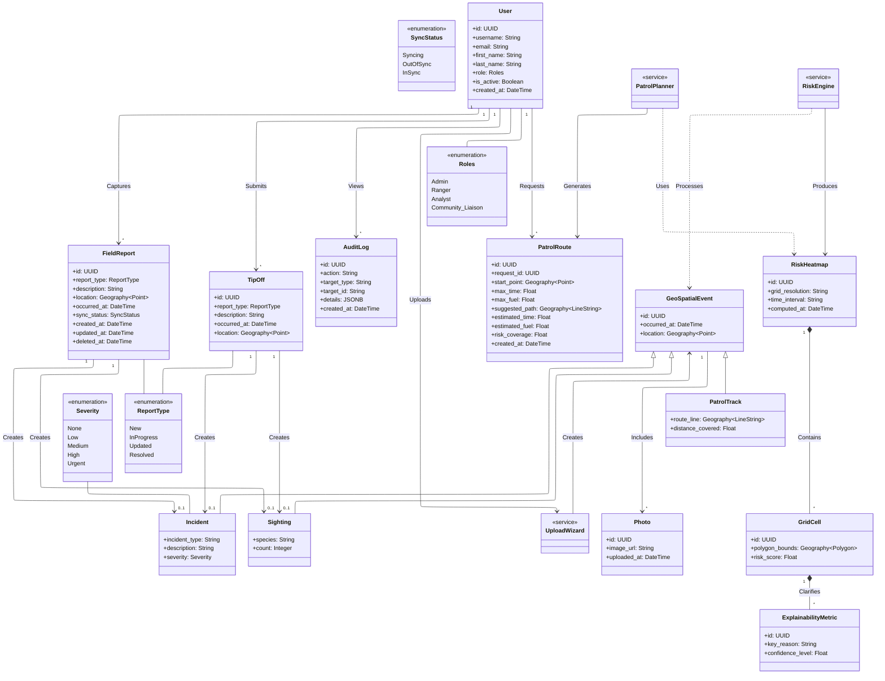

```mermaid
---
config:
  layout: elk
---

classDiagram
    class Severity {
        <<enumeration>>
        None
        Low
        Medium
        High
        Urgent
    }

    class SyncStatus {
        <<enumeration>>
        Syncing
        OutOfSync
        InSync
    }

    class ReportType {
        <<enumeration>>
        New
        InProgress
        Updated
        Resolved
    }

    class Roles {
        <<enumeration>>
        Admin
        Ranger
        Analyst
        Community_Liaison
    }

    class Incident {
        +incident_type: String
        +description: String
        +severity: Severity
    }

    class Sighting {
        +species: String
        +count: Integer
    }

    class FieldReport {
        +id: UUID
        +report_type: ReportType
        +description: String
        +location: Geography~Point~
        +occurred_at: DateTime
        +sync_status: SyncStatus
        +created_at: DateTime
        +updated_at: DateTime
        +deleted_at: DateTime
    }

    class TipOff {
        +id: UUID
        +report_type: ReportType
        +description: String
        +occurred_at: DateTime
        +location: Geography~Point~
    }

    class AuditLog {
        +id: UUID
        +action: String
        +target_type: String
        +target_id: String
        +details: JSONB
        +created_at: DateTime
    }

    class User {
        +id: UUID
        +username: String
        +email: String
        +first_name: String
        +last_name: String
        +role: Roles
        +is_active: Boolean
        +created_at: DateTime
    }

    class PatrolRoute {
        +id: UUID
        +request_id: UUID
        +start_point: Geography~Point~
        +max_time: Float
        +max_fuel: Float
        +suggested_path: Geography~LineString~
        +estimated_time: Float
        +estimated_fuel: Float
        +risk_coverage: Float
        +created_at: DateTime
    }

    class PatrolPlanner {
        <<service>>
    }

    class UploadWizard {
        <<service>>
    }

    class GeoSpatialEvent {
        +id: UUID
        +occurred_at: DateTime
        +location: Geography~Point~
    }

    class Photo {
        +id: UUID
        +image_url: String
        +uploaded_at: DateTime
    }

    class PatrolTrack {
        +route_line: Geography~LineString~
        +distance_covered: Float
    }

    class RiskHeatmap {
        +id: UUID
        +grid_resolution: String
        +time_interval: String
        +computed_at: DateTime
    }

    class GridCell {
        +id: UUID
        +polygon_bounds: Geography~Polygon~
        +risk_score: Float
    }

    class ExplainabilityMetric {
        +id: UUID
        +key_reason: String
        +confidence_level: Float
    }

    class RiskEngine {
        <<service>>
    }

    User "1" --> "*" FieldReport: Captures
    User "1" --> "*" TipOff: Submits
    User "1" --> "*" AuditLog: Views
    User "1" --> "*" PatrolRoute: Requests
    User --> UploadWizard: Uploads

    FieldReport "1" --> "0..1" Incident: Creates
    FieldReport "1" --> "0..1" Sighting: Creates
    TipOff "1" --> "0..1" Incident: Creates
    TipOff "1" --> "0..1" Sighting: Creates

    GeoSpatialEvent <|-- PatrolTrack
    GeoSpatialEvent <|-- Incident
    GeoSpatialEvent <|-- Sighting
    GeoSpatialEvent <-- UploadWizard: Creates
    GeoSpatialEvent "1" --> "*" Photo: Includes

    RiskEngine ..> GeoSpatialEvent: Processes
    RiskEngine --> RiskHeatmap: Produces

    PatrolPlanner --> PatrolRoute: Generates
    PatrolPlanner ..> RiskHeatmap: Uses

    RiskHeatmap "1" *-- "*" GridCell: Contains
    GridCell "1" *-- "*" ExplainabilityMetric: Clarifies


    %% Enums

    Severity -- Incident
    FieldReport -- ReportType
    TipOff -- ReportType
    User -- Roles
```
