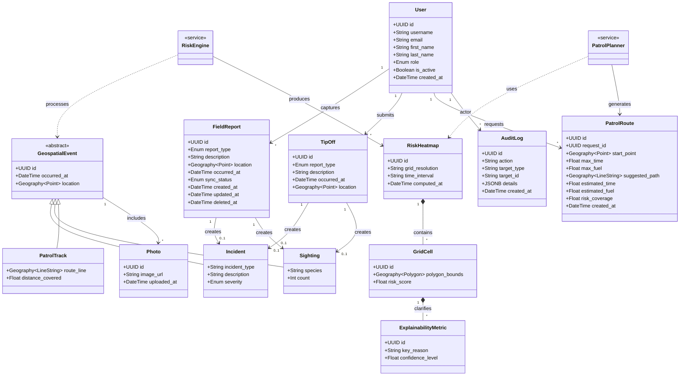

```mermaid
classDiagram

    %% ── USER ────────────────────────────────────────────────────────────────

    class User {
        +UUID id
        +String username
        +String email
        +String first_name
        +String last_name
        +Enum role
        +Boolean is_active
        +DateTime created_at
    }

    %% ── DOMAIN SERVICES ─────────────────────────────────────────────────────

    class RiskEngine {
        <<service>>
    }

    class PatrolPlanner {
        <<service>>
    }

    %% ── GEOSPATIAL EVENT HIERARCHY ───────────────────────────────────────────

    class GeospatialEvent {
        <<abstract>>
        +UUID id
        +DateTime occurred_at
        +Geography~Point~ location
    }

    class Incident {
        +String incident_type
        +String description
        +Enum severity
    }

    class Sighting {
        +String species
        +Int count
    }

    class PatrolTrack {
        +Geography~LineString~ route_line
        +Float distance_covered
    }

    GeospatialEvent <|-- Incident
    GeospatialEvent <|-- Sighting
    GeospatialEvent <|-- PatrolTrack

    %% ── FIELD REPORT ────────────────────────────────────────────────────────

    class FieldReport {
        +UUID id
        +Enum report_type
        +String description
        +Geography~Point~ location
        +DateTime occurred_at
        +Enum sync_status
        +DateTime created_at
        +DateTime updated_at
        +DateTime deleted_at
    }

    %% ── TIP-OFF ─────────────────────────────────────────────────────────────

    class TipOff {
        +UUID id
        +Enum report_type
        +String description
        +DateTime occurred_at
        +Geography~Point~ location
    }

    %% ── MEDIA ───────────────────────────────────────────────────────────────

    class Photo {
        +UUID id
        +String image_url
        +DateTime uploaded_at
    }


    %% ── RISK ENGINE ─────────────────────────────────────────────────────────

    class RiskHeatmap {
        +UUID id
        +String grid_resolution
        +String time_interval
        +DateTime computed_at
    }

    class GridCell {
        +UUID id
        +Geography~Polygon~ polygon_bounds
        +Float risk_score
    }

    class ExplainabilityMetric {
        +UUID id
        +String key_reason
        +Float confidence_level
    }

    %% ── PATROL PLANNING ─────────────────────────────────────────────────────

    class PatrolRoute {
        +UUID id
        +UUID request_id
        +Geography~Point~ start_point
        +Float max_time
        +Float max_fuel
        +Geography~LineString~ suggested_path
        +Float estimated_time
        +Float estimated_fuel
        +Float risk_coverage
        +DateTime created_at
    }

    %% ── AUDIT ───────────────────────────────────────────────────────────────

    class AuditLog {
        +UUID id
        +String action
        +String target_type
        +String target_id
        +JSONB details
        +DateTime created_at
    }

    %% ── RELATIONSHIPS ───────────────────────────────────────────────────────

    %% User interactions
    User "1" --> "*" FieldReport : captures
    User "1" --> "*" TipOff : submits
    User "1" --> "*" PatrolRoute : requests
    User "1" --> "*" AuditLog : actor

    %% FieldReport and TipOff produce geospatial events
    FieldReport "1" --> "0..1" Incident : creates
    FieldReport "1" --> "0..1" Sighting : creates
    TipOff "1" --> "0..1" Incident : creates
    TipOff "1" --> "0..1" Sighting : creates

    %% Risk engine domain service
    RiskEngine ..> GeospatialEvent : processes
    RiskEngine --> RiskHeatmap : produces

    %% Patrol planner domain service
    PatrolPlanner ..> RiskHeatmap : uses
    PatrolPlanner --> PatrolRoute : generates

    %% Risk heatmap structure
    RiskHeatmap "1" *-- "*" GridCell : contains
    GridCell "1" *-- "*" ExplainabilityMetric : clarifies

    %% Photo evidence
    GeospatialEvent "1" --> "*" Photo : includes
```
