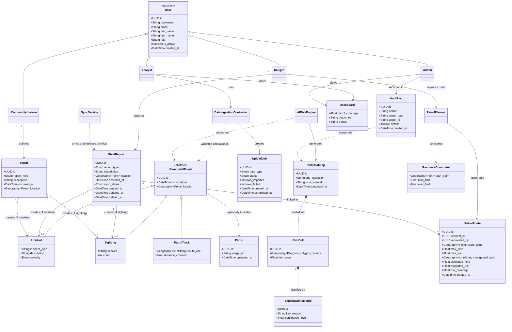

```mermaid
classDiagram

    %% ── USER HIERARCHY ──────────────────────────────────────────────────────

    class User {
        <<abstract>>
        +UUID id
        +String username
        +String email
        +String first_name
        +String last_name
        +Enum role
        +Boolean is_active
        +DateTime created_at
    }

    class Ranger {
    }

    class Analyst {
    }

    class CommunityLiaison {
    }

    class Admin {
    }

    User <|-- Ranger
    User <|-- Analyst
    User <|-- CommunityLiaison
    User <|-- Admin

    %% ── SYSTEM SERVICES ─────────────────────────────────────────────────────

    class DataIngestionController {
    }

    class AIRiskEngine {
    }

    class PatrolPlanner {
    }

    class SyncService {
    }

    class Dashboard {
        +Float patrol_coverage
        +String outcomes
        +String trends
    }

    %% ── GEOSPATIAL EVENT HIERARCHY ───────────────────────────────────────────
    %% Covers CSV-imported historical data; also created by FieldReports and TipOffs

    class GeospatialEvent {
        <<abstract>>
        +UUID id
        +DateTime occurred_at
        +Geography~Point~ location
    }

    class Incident {
        +String incident_type
        +String description
        +Enum severity
    }

    class Sighting {
        +String species
        +Int count
    }

    class PatrolTrack {
        +Geography~LineString~ route_line
        +Float distance_covered
    }

    class TipOff {
        +UUID id
        +Enum report_type
        +String description
        +DateTime occurred_at
        +Geography~Point~ location
    }

    GeospatialEvent <|-- Incident
    GeospatialEvent <|-- Sighting
    GeospatialEvent <|-- PatrolTrack

    %% ── FIELD REPORT (PWA offline capture) ──────────────────────────────────

    class FieldReport {
        +UUID id
        +Enum report_type
        +String description
        +Geography~Point~ location
        +DateTime occurred_at
        +Enum sync_status
        +DateTime created_at
        +DateTime updated_at
        +DateTime deleted_at
    }

    %% ── MEDIA ───────────────────────────────────────────────────────────────

    class Photo {
        +UUID id
        +String image_url
        +DateTime uploaded_at
    }

    %% ── DATA INGESTION ──────────────────────────────────────────────────────

    class UploadJob {
        +UUID id
        +Enum data_type
        +Enum status
        +Int rows_imported
        +Int rows_failed
        +DateTime queued_at
        +DateTime completed_at
    }

    %% ── RISK ENGINE ─────────────────────────────────────────────────────────

    class RiskHeatmap {
        +UUID id
        +String grid_resolution
        +String time_interval
        +DateTime computed_at
    }

    class GridCell {
        +UUID id
        +Geography~Polygon~ polygon_bounds
        +Float risk_score
    }

    class ExplainabilityMetric {
        +UUID id
        +String key_reason
        +Float confidence_level
    }

    %% ── PATROL PLANNING ─────────────────────────────────────────────────────

    class ResourceConstraint {
        +Geography~Point~ start_point
        +Float max_time
        +Float max_fuel
    }

    class PatrolRoute {
        +UUID id
        +UUID request_id
        +UUID requested_by
        +Geography~Point~ start_point
        +Float max_time
        +Float max_fuel
        +Geography~LineString~ suggested_path
        +Float estimated_time
        +Float estimated_fuel
        +Float risk_coverage
        +DateTime created_at
    }

    %% ── AUDIT ───────────────────────────────────────────────────────────────

    class AuditLog {
        +UUID id
        +String action
        +String target_type
        +String target_id
        +JSONB details
        +DateTime created_at
    }

    %% ── RELATIONSHIPS ───────────────────────────────────────────────────────

    %% User interactions
    Analyst --> DataIngestionController : uses
    Ranger "1" --> "*" FieldReport : captures
    Ranger --> PatrolPlanner : requests route
    CommunityLiaison "1" --> "*" TipOff : submits
    Analyst --> Dashboard : views
    Admin --> Dashboard : views
    Admin "1" --> "*" AuditLog : recorded in

    %% Data ingestion pipeline
    DataIngestionController ..> GeospatialEvent : validates and uploads
    DataIngestionController --> UploadJob : creates

    %% AI risk engine
    AIRiskEngine ..> GeospatialEvent : consumes
    AIRiskEngine --> RiskHeatmap : generates

    %% Patrol planning
    PatrolPlanner ..> RiskHeatmap : consumes
    PatrolPlanner ..> ResourceConstraint : consumes
    PatrolPlanner --> PatrolRoute : generates

    %% Offline sync
    SyncService ..> FieldReport : syncs and resolves conflicts

    %% FieldReport creates a geospatial event (incident xor sighting based on report_type)
    FieldReport "1" --> "0..1" Incident : creates (if incident)
    FieldReport "1" --> "0..1" Sighting : creates (if sighting)

    %% TipOff creates a geospatial event (incident xor sighting based on report_type)
    TipOff "1" --> "0..1" Incident : creates (if incident)
    TipOff "1" --> "0..1" Sighting : creates (if sighting)

    %% Risk heatmap structure
    RiskHeatmap "1" *-- "*" GridCell : divided into
    GridCell "1" *-- "*" ExplainabilityMetric : clarified by

    %% Photo evidence linked to geospatial events
    GeospatialEvent "1" --> "*" Photo : optionally includes

    %% Field report linked to patrol route
    FieldReport "*" --> "0..1" PatrolRoute : linked to
```
