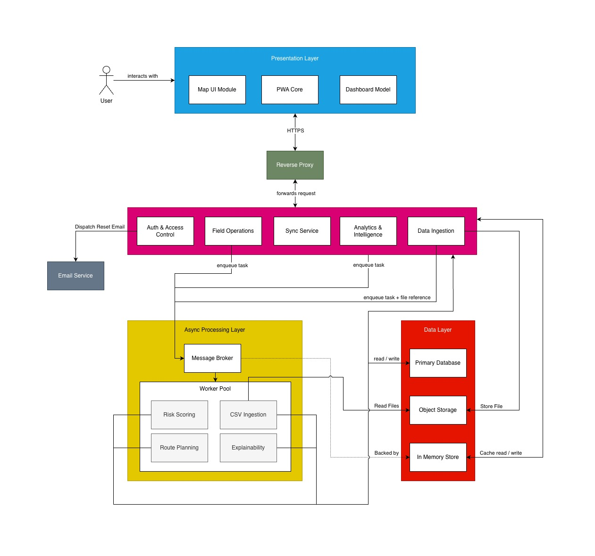

# SIGILL - Software Architecture Specification (SAS)

---

## Table of Contents

1. [Introduction](#introduction)
2. [Architectural Requirements](#architectural-requirements)
3. [Technology Requirements](#technology-requirements)
4. [API Contracts](#api-contracts)
5. [Deployment](#deployment)

---

## Introduction

This document indicates the architectural decisions that were made along the project's lifespan, and includes justification for these decisions. This includes the scaffolding for the project to run, the technology decided to implement the architectural plan, the API endpoint documentation, and how the application is deployed.

## Architectural Requirements

### Architectural Patterns

We use the N-Layered(5-Layered) architecture approach

- **Layer 1: Presentation Layer:** Contains everything that the user is shown, and receives responses from the bottom layers to determine what it should review
- **Layer 2: Reverse Proxy:** Any requests sent from the frontend will pass through the reverse proxy, which will ensure the request is encrypted.
- **Layer 3: Controller Layer:** Parses HTTP requests, validates request shape, enforces role-based access control via token inspection, and returns response models. Contains no business logic.
- **Layer 4:**
  - **Email Layer:** Handles sending emails to users when required.
  - **Async Processing Layer:** Contains the business logic of the program.
- **Layer 5: Data Layer:** Executes all database queries via an async session. Contains no business logic.

### Design Patterns

#### Factory

A factory method is used in the backend to perform role based authentication. There exists functionality to specify which roles are able to access an endpoint into the factory, and the factory shall return a function that validates these roles against the current user's role, removing the need to have a separate function for each role combination that can access an endpoint.

#### Memento

Memento will be used when the timeslider is implemented, allowing the state of the heatmap to change to previous versions in time easily.

#### Observer

Observer is used for the notification system. The backend will queue a notification, which the frontend will observe to determine if it should display the notification or not.

### Constraints

| Constraint                      | Description                                                                                                                                                                                                                                                                                                                                                                                 |
| ------------------------------- | ------------------------------------------------------------------------------------------------------------------------------------------------------------------------------------------------------------------------------------------------------------------------------------------------------------------------------------------------------------------------------------------- |
| Open Source Requirement         | All components and third-party libraries must be open-source. This avoids licensing costs, vendor lock-in, and ensures the solution remains maintainable beyond the project lifecycle.                                                                                                                                                                                                      |
| Deployment Requirement          | The system must be fully containerised using Docker. All services must be orchestrated through Docker Compose and deployable via a single docker compose up command with no manual configuration steps. GitHub Actions is used for CI/CD to validate builds and run tests before any merge to the main branch. The production environment must enforce HTTPS and role-based access control. |
| Progressive Web App Requirement | The system must be delivered as a PWA. This is a hard requirement driven by the field environment where rangers operate without guaranteed connectivity. The PWA must support offline data capture and synchronise with the central database once connection is restored.                                                                                                                   |
| Data Sensitivity                | The system handles sensitive conservation data including poaching incident locations, patrol routes, and informant tip-offs. All data in transit must be encrypted via HTTPS, and sensitive map layers must be restricted by authenticated user roles.                                                                                                                                      |
| Budget Constraint               | The total project budget provided by EPI-USE is capped at R5000. All cloud services, third-party integrations, and tooling must be operated within this limit.                                                                                                                                                                                                                              |

### Architectural Diagram

Original Image can be found at `docs > demo2 > architecture`, if a higher resolution is required



### Quality Requirement Mapping

| Quality Requirement                    | Architectural Decision                                                                                                                                                                                                                                                                                                              |
| -------------------------------------- | ----------------------------------------------------------------------------------------------------------------------------------------------------------------------------------------------------------------------------------------------------------------------------------------------------------------------------------- |
| Security                               | Implementation of AES-256/TLS1.3 encryption, and the use of JWT with RBAC to enforce API endpoint access.                                                                                                                                                                                                                           |
| Reliability >= 99.9% uptime            | Docker Compose restart policies ensure automatic recovery of crashed containers.<br />Additionally the PWA functionality ensures that the application is still able to function even if the server becomes temporarily unavailable.                                                                                                 |
| Performance for 60 concurrent users    | FastAPI's async I/O prevents blocking during concurrent requests. PostGIS GiST indexing and Redis caching will also improve performance during heavy queries, while the client will use MapLibre GL to handle client-side rendering, improving performance.                                                                        |
| Maximum of 2 hours downtime in a month | CI/CD prevents broken code from reaching our production, and in the case of downtime, our redeploy previous commit strategy ensures a rapid recovery within 2 hours if deployment fails.                                                                                                                                            |
| Maintainability                        | * Implementation of Github actions using its CI pipeline, running an automated test suite to ensure that requirements are matched.<br />* Implementation of SonarQube to point out maintainability issues in code, to ensure easy modification of code in the future.<br />* Codecov ensures that test coverage hits at least 75% |

## Technology Requirements

The technology requirements for Savanna Sentinel encompass the architectural and delivery requirements that ensure the system supports a reliable, scalable, performant, and secure Progressive Web App (PWA). We have taken into consideration the following technology requirements while choosing the tech stack for Savanna Sentinel.

The technology requirements for Savanna Sentinel encompass the architectural and delivery requirements that ensure the system supports a reliable, scalable, performant, and secure Progressive Web App (PWA). We have taken into consideration the following technology requirements while choosing the tech stack for Savanna Sentinel.

### Technology Stack Overview

| Purpose         | Solution                                |
| --------------- | --------------------------------------- |
| Frontend        | React 19 (Typescript)                   |
| UI Components   | shadcn/ui + Tailwind CSS v4             |
| Mapping         | MapLibre GL                             |
| PWA / Offline   | Workbox + Dexie.js (IndexedDB)          |
| Backend API     | Python FastAPI                          |
| Background Jobs | Celery + Redis                          |
| Database        | PostgreSQL +  PostGIS                   |
| Object Storage  | Seaweed                                   |
| AI / ML         | sckit-learn + GeoPandas + pandas + SHAP |
| Security        | JWT(PyJWT, HS256)                       |
| Reverse Proxy   | Caddy                                   |
| Email           | Resend SDK                              |
| DevOps / CI     | Docker + Github Actions                 |

---

### Frontend

**Chosen Technology:** React with Typescript

React was explicitly recommended by our client EPI-USE in the project proposal. Beyond the client's preference, it is the most suitable choice for the following reasons:

- **PWA support:** React integrates natively with Workbox service workers, satisfying the offline field capture requirement without an additional framework layer.
- **Type Safety:** TypeScript catches type mismatches between geospatial API responses and map layer data at compile time, reducing the class of bugs most likely to occur.
- **MapLibre GL integration:** The `react-map-gl` binding for MapLibre GL supports the heatmap layer, time range slider, and role based layer visibility without custom WebGL code.'
- **Component isolation:**  The explainability panel, patrol comparison interface, and dashboard cards can be developed as independent components, supporting parallel development.

**Alternative considered - Angular:** Angular was listed in the proposal as an option. We decided against it, because the team's existing React/TypeScript proficiency would have required relearning Angular's dependency injection and zone based change detection, reducing development velocity without any functional benefit for this project.

### UI Components & Styling

**Chosen Technology:** shadcn/ui with Tailwind CSS

shadcn/ui is a React component library built on Radix UI primitives and styled with Tailwind CSS utility classes.

- **Ownership model:** shadcn components are copied directly into the project codebase rather than installed as a black-box dependency. This means every component (buttons, forms, modals, navigation) can be customised to match the Savanna Sentinel brand palette and typography without fighting an external design system.
- **Tailwind Integration:** Tailwind's utility-first CSS classes provide precise layout and spacing control across the dashboard, map interface, and mobile PWA forms without writing custom CSS files.
- **Lucide Icons:** shadcn ships with Lucide as its default icon set, which is already specified in the Brand Style guide. No additional icon library is required.
- **Accessibility:** shadcn components are built on Radix UI, which provides ARIA roles, keyboard navigation, and focus management out of the box, directly supporting the WCAG 2.1 AA accessibility requirements.
- **Radix UI primitives:** Complex interactive components such as modals, dropdowns, sliders (time range), and tooltips (explainability panel) are handled by Radix UI's headless primitives, ensuring correct behaviour without custom implementation.

**Alternative considered - Bootstrap:** Bootstrap was considered due to team familiarity. It was not selected because it ships its own opinionated CSS that conflicts with Tailwind utility classes, requires a separate react-bootstrap wrapper package to function properly in React, and makes it significantly harder to apply a custom brand palette without overriding its defaults. shadcn + Tailwind provides the same component coverage with full control over styling and no class-name conflicts.

### Mapping

**Chosen Technology:** MapLibre GL with OpenStreetMap tiles

MapLibre GL renders map tiles and overlay layers using the device GPU via WebGL rather than browser side JavaScript loops, which is critical for the project

- **Heatmap performance:** Risk heatmaps covering large reserves (thousands of grid cells) must render smoothly as the user drags the time slider. CPU based libraries such as Leaflet with canvas heatmap plugins stutter above approximately 5 000 points on mid range devices.
- **No licensing cost:** MapLibre GL is fully open source using free OpenStreetMap tiles.
- **Vector tile support:** MapLibre supports vector tile sources, enabling role based layer toggling at the client without additional server round trips. Sensitive layers can be managed by role based access control.

**Alternative considered - Leaflet:** Leaflet was evaluated due to its simplicity, large plugin ecosystem, and ease of integration with React. However, it was not selected because it relies primarily on CPU based rendering, which does not scale efficiently for large geospatial datasets. In performance testing scenarios relevant to this project (thousands of spatial points and dynamic heatmaps), Leaflet exhibits noticeable lag and reduced frame rates on mid range devices. Additionally, Leaflet lacks native vector tile support and GPU acceleration, requiring additional plugins and workarounds that increase complexity without achieving MapLibre GL's performance characteristics

### PWA / Offline

**Chosen Technology:** Workbox (service workers) with Dexie.js as a typed IndexedDB wrapper for structured offline storage.

Offline capability is a first class requirement. Rangers operate in reserves with no mobile data coverage.

- Workbox precaches the application shell so the app loads without a network connection. The Background Sync API queues POST requests (incident reports, sightings) and replays them automatically when connectivity is restored.
- Dexie.js provides a clean, typed API over IndexedDB to store draft field reports locally on the device. Timestamp based conflict resolution is applied server side when the upload reaches the FastAPI backend.
- Photo uploads are queued as blob references in IndexedDB and uploaded to Seaweed once online, avoiding data loss for large files.

### Backend API

**Chosen Technology:** Python FastAPI

FastAPI was recommended by the client and is the optimal choice for reasons beyond the client's preference.

- **OpenAPI auto generation:** FastAPI produces an /openapi.json specification automatically from Python type annotations, satisfying the architectural requirement for a versioned REST API with OpenAPI documentation without additional tooling.
- **Async I/O:** FastAPI runs on ASGI, enabling concurrent request handling for multiple rangers submitting field reports simultaneously without blocking.
- **Python ecosystem co-location:** The AI/ML modules (scikit-learn, GeoPandas, pandas, SHAP) run in the same Python environment as the API, eliminating the inter process serialisation overhead that would exist if the ML layer were written in a different language.
- **RBAC middleware:** FastAPI's dependency injection system is well suited to implementing role-checking middleware without cross cutting boilerplate.

**Alternative considered - Node.js:** Node.js was listed in the proposal. It was not selected because scikit-learn and GeoPandas do not have production equivalent JavaScript alternatives. Using Node.js would have required a separate Python microservice for ML, adding an inter service boundary and increasing operational complexity.

### Background Processing

**Chosen technology:** Celery with Redis as the message broker

Risk score computation and heatmap generation are computationally expensive operations that must not block synchronous API requests.

- Redis as the message broker is lightweight, easy to containerise, and provides the pub/sub mechanism Celery requires. The same Redis instance is reused for API level response caching, reducing repeated PostGIS query load.
- Celery Beat allows periodic model retraining and heatmap refresh to be configured as cron style tasks, satisfying the architectural requirement for background jobs without manual intervention.
- Worker isolation ensures a long running scoring job cannot starve API workers, preserving the system's performance quality attribute.

### Database

**Chosen technology:** PostgreSQL with PostGIS

The EPI-USE architectural requirements explicitly mandate PostGIS spatial indexing.

- **Spatial indexing:** PostGIS GiST and BRIN indexes support the spatial operations the risk engine depends on, `ST_Within`, `ST_DWithin`, and `ST_MakeGrid`, at the scale of millions of historical incident records.
- **ACID compliance:** Field report data is safety critical. PostgreSQL transactional guarantees ensure a partial sync from a ranger's device either fully commits or rolls back, preventing corrupt sighting records.
- **JSONB columns:** Heterogeneous tip off payloads and field report attachments are stored in JSONB columns, providing flexible schema within typed columns without sacrificing queryability.
- **Row-Level Security (RLS):** PostgreSQL RLS policies enforce role based data redaction at the database layer as a defence-in-depth measure supplementing application level RBAC.

### Object Storage

**Chosen technology:** Seaweed

CSV uploads and optional photo classifications require blob storage separate from the relational database.

- **API compatibility:** The application uses the standard boto3 Python SDK. If the project later migrates to AWS S3 or another provider, no code changes are required - only an environment variable update.
- **Self hosted within budget:** Seaweed runs as a Docker container within the same Compose stack. There are no per-GB transfer fees during development.
- **Pre-signed URLs:** Allow the frontend to upload photos directly to Seaweed without routing large files through the FastAPI backend, reducing server load.

### AI / ML

**Chosen technology:** scikit-learn, GeoPandas, pandas, SHAP

The AI Risk Engine requires risk scoring, spatial feature engineering, explainability metrics, and general data processing. This combination maps directly to those four concerns.

- **scikit-learn:** Provides gradient boosting and ensemble classifiers (Random Forest, XGBoost-compatible pipelines) that are appropriate for tabular spatio temporal incident data. These models outperform deep learning on small structured datasets typical of reserve scale historical records.
- **GeoPandas:** Handles spatial feature engineering: converting incident coordinates into grid cells, computing kernel density estimates per cell, and joining patrol coverage data with incident locations.
- **pandas:** Used alongside GeoPandas for general data manipulation, cleaning, transformation, and preprocessing of tabular datasets before spatial operations and model training.
- **SHAP (SHapley Additive exPlanations):** Generates per-cell explainability metrics, detailing the contribution of each feature to a given risk score. This satisfies the functional requirement for an explainability panel that communicates model reasoning without overclaiming certainty.

### Security

**Chosen technology:** PyJWT with HS256 symmetric signing

Authentication and RBAC require a stateless session mechanism compatible with both the web dashboard and PWA offline mode.

- **Stateless tokens:** JWT tokens are self contained, enabling FastAPI to validate requests without a database round trip per request, which is important for high frequency map tile and sync requests.
- **HS256 symmetric signing:** A single shared secret is used to both sign and verify tokens. This is appropriate for a monolithic deployment where all services share the same secret via environment variable.
- **Role claims in token payload:** The user's role (Ranger, Analyst, Community Liaison, Admin) is encoded in the JWT. FastAPI dependency injection reads this claim to enforce view and data restrictions without querying the database on each request.
- **Refresh token tracking:** Issued refresh tokens are stored in the database with their JTI, expiry, and revocation timestamp, enabling secure logout and token invalidation without sacrificing stateless access token validation.
- **HTTPS enforcement:** All endpoints are served over TLS via a Caddy reverse proxy with automatic certificate provisioning.

### Reverse Proxy

**Chosen technology:** Caddy

All external traffic passes through Caddy before reaching the FastAPI backend.

- **Automatic TLS:** Caddy provisions and renews TLS certificates automatically, satisfying the requirement that no endpoint is accessible over unencrypted HTTP without manual certificate management.
- **Simple configuration:** Caddy's declarative Caddyfile syntax reduces operational overhead compared to alternatives such as Nginx, with no separate certbot process required.
- **Containerised deployment:** Caddy runs as a Docker container within the same Compose stack, keeping the full system deployable via a single docker compose up command.

### DevOps / CI

**Chosen technology:** Docker with Docker Compose and GitHub Actions

The architectural requirements require containerised deployment and a CI pipeline with automated testing.

- **Docker Compose:** Defines the full local environment (FastAPI, Celery, Redis, PostgreSQL+PostGIS, Seaweed, Caddy) as a single `docker compose up` command, ensuring all team members develop against identical dependencies.
- **GitHub Actions:** Runs on every push and pull request to main. The pipeline executes backend unit and integration tests (pytest), frontend unit tests (Vitest), SonarCloud static analysis, and Coveralls coverage upload. Merging to main is blocked if any stage fails.
- **Branch protection rules:** Enforce mandatory pull requests and passing CI checks before merging.
- **The main branch:** Always reflects a deployable state.

### Transactional Email

**Chosen technology:** Resend (SMTP relay) with the resend Python SDK

A transactional email service is required to deliver password reset links generated by the password recovery flow.

- Resend provides a developer-focused SMTP relay with a free tier (100 emails/day) that operates within the project budget constraint.
- **SDK integration:** The resend Python package integrates directly into the FastAPI service layer. No additional worker or container is required; reset emails are dispatched inline during the forgot-password request handler.
- **Open standard:** Resend uses standard SMTP and a minimal REST SDK. Migrating to an alternative provider (Mailgun, SendGrid, AWS SES) requires only an environment variable and SDK swap with no architectural change.
- **No self-hosted mail server:** Running a self-hosted SMTP server (Postfix, Mailhog in production) within the Docker Compose stack was considered but rejected due to deliverability risks and the operational overhead of managing SPF/DKIM records within the project timeline.

## API Contracts

### SC-01: Register User

|                    |                            |
| ------------------ | -------------------------- |
| **Endpoint** | `POST /v1/auth/register` |
| **Access**   | Public                     |

**Preconditions**

- The provided email address and username must not already exist in the system.
- `password` must be at least 8 characters long.
- `requested_role` must be one of: `community_liaison`, `ranger`, `analyst`.

**Request Body**

| Field          | Type   | Required |
| -------------- | ------ | -------- |
| username       | string | Yes      |
| email          | string | Yes      |
| password       | string | Yes      |
| first_name     | string | Yes      |
| last_name      | string | Yes      |
| requested_role | string | Yes      |

**Postconditions**

- A new user account is created with the `requested_role` as the user's role and `is_active: false`.
- The account cannot be used to log in until an Admin activates it.

**Response `201 Created`**

```json
{
  "id": "string",
  "username": "string",
  "email": "string",
  "role": "string",
  "is_active": false,
  "created_at": "ISO 8601"
}
```

**Error Responses**

| Status | Condition                        |
| ------ | -------------------------------- |
| 400    | Missing or invalid fields        |
| 409    | Email or username already in use |

---

### SC-02: Login

|                    |                         |
| ------------------ | ----------------------- |
| **Endpoint** | `POST /v1/auth/login` |
| **Access**   | Public                  |

> **Security note:** To prevent user enumeration, the server must not distinguish between an incorrect username, an incorrect password, or an inactive account in the error response. All failure cases return the same `401` response with a generic message.

**Preconditions**

- The request body must contain a non-empty username and password.

**Request Body**

| Field    | Type   | Required |
| -------- | ------ | -------- |
| username | string | Yes      |
| password | string | Yes      |

**Postconditions**

- A signed JWT access token and refresh token are issued to the client.
- The access token expires after 3600 seconds.

**Response `200 OK`**

```json
{
  "access_token": "string",
  "refresh_token": "string",
  "token_type": "bearer",
  "expires_in": 3600,
  "user": {
    "id": "string",
    "username": "string",
    "role": "string"
  }
}
```

**Error Responses**

| Status | Condition                                                 |
| ------ | --------------------------------------------------------- |
| 401    | Credentials are invalid or the account cannot be accessed |

---

### SC-03: Logout

|                    |                          |
| ------------------ | ------------------------ |
| **Endpoint** | `POST /v1/auth/logout` |
| **Access**   | All authenticated roles  |

**Preconditions**

- The request must include a valid JWT access token in the `Authorization` header.
- The request body must contain the refresh token to be revoked.

**Request Body**

| Field         | Type   | Required |
| ------------- | ------ | -------- |
| refresh_token | string | Yes      |

**Postconditions**

- The provided refresh token is revoked (`revoked_at` is set in the database) and can no longer be used to issue new access tokens.
- The session is considered terminated; the access token should be discarded client-side.

**Response `204 No Content`**

**Error Responses**

| Status | Condition                       |
| ------ | ------------------------------- |
| 400    | `refresh_token` field missing |
| 403    | Access token missing or invalid |

---

### SC-04: Refresh Access Token

|                    |                           |
| ------------------ | ------------------------- |
| **Endpoint** | `POST /v1/auth/refresh` |
| **Access**   | Public                    |

**Preconditions**

- The request body must contain a valid, non-revoked refresh token.

**Request Body**

| Field         | Type   | Required |
| ------------- | ------ | -------- |
| refresh_token | string | Yes      |

**Postconditions**

- A new signed JWT access token and refresh token are issued (token rotation).
- The previous refresh token is invalidated.
- The new access token expires after 3600 seconds.

**Response `200 OK`**

```json
{
  "access_token": "string",
  "refresh_token": "string",
  "token_type": "bearer",
  "expires_in": 3600,
  "user": {
    "id": "string",
    "username": "string",
    "role": "string"
  }
}
```

**Error Responses**

| Status | Condition                                     |
| ------ | --------------------------------------------- |
| 403    | Refresh token is missing, invalid, or revoked |

---

### SC-05: Get Own Profile

|                    |                         |
| ------------------ | ----------------------- |
| **Endpoint** | `GET /v1/users/me`    |
| **Access**   | All authenticated roles |

**Preconditions**

- The request must include a valid JWT access token.

**Postconditions**

- None. Read-only operation.

**Response `200 OK`**

```json
{
  "id": "string",
  "username": "string",
  "email": "string",
  "first_name": "string",
  "last_name": "string",
  "role": "string",
  "is_active": "boolean",
  "created_at": "ISO 8601"
}
```

**Error Responses**

| Status | Condition                |
| ------ | ------------------------ |
| 401    | Token missing or invalid |

---

### SC-06: Update Own Profile

|                    |                         |
| ------------------ | ----------------------- |
| **Endpoint** | `PATCH /v1/users/me`  |
| **Access**   | All authenticated roles |

**Preconditions**

- At least one updatable field must be present in the request body.
- If `new_password` is provided, `current_password` must also be provided and must be correct.

**Request Body**

| Field            | Type   | Required |
| ---------------- | ------ | -------- |
| first_name       | string | No       |
| last_name        | string | No       |
| current_password | string | No       |
| new_password     | string | No       |

**Postconditions**

- The authenticated user's profile is updated with the provided values.
- If password is changed, all existing refresh tokens for the user are revoked.

**Response `200 OK`** - Returns the updated user profile object (same shape as SC-05).

**Error Responses**

| Status | Condition                         |
| ------ | --------------------------------- |
| 400    | No updatable fields provided      |
| 403    | Token missing or invalid          |
| 403    | `current_password` is incorrect |

---

### SC-07: Upload and Validate CSV Data

|                    |                               |
| ------------------ | ----------------------------- |
| **Endpoint** | `POST /v1/ingestion/upload` |
| **Access**   | `analyst`, `admin`        |

**Preconditions**

- `data_type` must be one of: `incidents`, `patrol_tracks`, `sightings`, `tipoffs`.
- The uploaded file must be a valid CSV.

**Request Body**

| Field     | Type                                          | Required |
| --------- | --------------------------------------------- | -------- |
| start_row | integer                                       | Yes      |
| data_type | incidents, patrol_tracks, sightings, tipoffs. | Yes      |
| records   | Custom                                        | Yes      |

**Postconditions**

- The csv data is parsed and uploaded to the database.

**Response `200 OK`**

```json
{
  "status": "string",
  "message": "string",
}
```

| Status | Condition                                         |
| ------ | ------------------------------------------------- |
| 403    | Refresh token is missing, invalid, or revoked.    |
| 422    | Uploaded data does not match the selected schema. |

### SC-08: Request Pre-Signed Upload URL

|                    |                                              |
| ------------------ | -------------------------------------------- |
| **Endpoint** | `POST /v1/media/upload-url`                |
| **Access**   | `ranger`, `community_liaison`, `admin` |

**Preconditions**

- `file_name` must be a non-empty string.
- `content_type` must be a valid image MIME type (e.g. `image/jpeg`, `image/png`).

**Request Body**

| Field        | Type   | Required |
| ------------ | ------ | -------- |
| file_name    | string | Yes      |
| content_type | string | Yes      |

**Postconditions**

- A pre-signed Seaweed URL is generated allowing the client to upload directly to object storage.
- The URL expires after 300 seconds.

**Response `200 OK`**

```json
{
  "upload_url": "string",
  "object_url": "string",
  "expires_in": 300
}
```

> The client uploads the file directly to `upload_url` via HTTP `PUT`. On success, `object_url` is the permanent reference to include in the `images` array of a subsequent report or tip-off submission.

**Error Responses**

| Status | Condition                 |
| ------ | ------------------------- |
| 400    | Missing or invalid fields |
| 403    | Role not permitted        |

---

### SC-09: Submit Field Report

|                    |                       |
| ------------------ | --------------------- |
| **Endpoint** | `POST /v1/reports`  |
| **Access**   | `ranger`, `admin` |

**Preconditions**

- `report_type` must be one of: `incident`, `sighting`.
- `location` must contain a valid latitude and longitude pair.
- `occurred_at` must not be a future date and time.
- Each entry in `images` must be a valid Seaweed object URL previously obtained via SC-08.
- If `report_type` is `incident`, `incident_type` must be provided.
- If `report_type` is `sighting`, `species` must be provided.

**Request Body**

| Field         | Type                           | Required                                     |
| ------------- | ------------------------------ | -------------------------------------------- |
| report_type   | string                         | Yes                                          |
| location      | `{ lat: float, lon: float }` | Yes                                          |
| occurred_at   | ISO 8601                       | Yes                                          |
| description   | string                         | Yes                                          |
| incident_type | string                         | Required when`report_type` is `incident` |
| severity      | `low \| medium \| high`        | Optional when`report_type` is `incident` |
| species       | string                         | Required when`report_type` is `sighting` |
| count         | integer                        | Optional when`report_type` is `sighting` |
| images        | array of object URLs           | No                                           |
| route_id      | string                         | No                                           |
| sync_status   | `offline \| pending \| synced` | No                                           |

**Postconditions**

- The report is persisted and associated with the authenticated user.
- A corresponding geospatial event is created and linked: an `incidents` record if `report_type` is `incident`; a `sightings` record if `report_type` is `sighting`.
- If `route_id` is provided and refers to an existing route, the report is linked to that route.

**Response `201 Created`**

```json
{
  "report_id": "string",
  "report_type": "string",
  "status": "submitted",
  "submitted_by": "string",
  "created_at": "ISO 8601"
}
```

**Error Responses**

| Status | Condition                                                    |
| ------ | ------------------------------------------------------------ |
| 400    | Missing required fields                                      |
| 403    | Role not permitted to submit reports                         |
| 422    | `occurred_at` is in the future, or coordinates are invalid |

---

### SC-10: Edit Field Report

|                    |                                   |
| ------------------ | --------------------------------- |
| **Endpoint** | `PATCH /v1/reports/{report_id}` |
| **Access**   | `ranger`, `admin`             |

**Preconditions**

- `report_id` must refer to an existing report.
- A Ranger may only edit their own reports. An Admin may edit any report.
- At least one updatable field must be present.
- `occurred_at`, if provided, must not be a future date and time.

**Request Body**

| Field         | Type                           | Required |
| ------------- | ------------------------------ | -------- |
| description   | string                         | No       |
| location      | `{ lat: float, lon: float }` | No       |
| occurred_at   | ISO 8601                       | No       |
| images        | array of object URLs           | No       |
| incident_type | string                         | No       |
| severity      | `low \| medium \| high`        | No       |
| species       | string                         | No       |
| count         | integer                        | No       |

**Postconditions**

- The report is updated with the provided values.
- `sync_status` is set to `synced`.

**Response `200 OK`** - Returns the updated report object (same shape as SC-11 response).

**Error Responses**

| Status | Condition                                                    |
| ------ | ------------------------------------------------------------ |
| 400    | No updatable fields provided                                 |
| 401    | Token missing or invalid                                     |
| 403    | Ranger attempting to edit another user's report              |
| 404    | Report ID does not exist                                     |
| 422    | `occurred_at` is in the future, or coordinates are invalid |

---

### SC-11: Delete Field Report

|                    |                                    |
| ------------------ | ---------------------------------- |
| **Endpoint** | `DELETE /v1/reports/{report_id}` |
| **Access**   | `ranger`, `admin`              |

**Preconditions**

- `report_id` must refer to an existing report.
- A Ranger may only delete their own reports. An Admin may delete any report.

**Postconditions**

- The report record is soft-deleted: marked as deleted and excluded from all queries, but retained in the database for audit purposes.

**Response `204 No Content`**

**Error Responses**

| Status | Condition                                         |
| ------ | ------------------------------------------------- |
| 401    | Token missing or invalid                          |
| 403    | Ranger attempting to delete another user's report |
| 404    | Report ID does not exist                          |

---

### SC-12: Submit Community Tip-off

|                    |                                  |
| ------------------ | -------------------------------- |
| **Endpoint** | `POST /v1/tipoffs`             |
| **Access**   | `community_liaison`, `admin` |

**Preconditions**

- `report_type` must be one of: `incident`, `sighting`.
- `location` must contain a valid latitude and longitude pair.
- `occurred_at` must not be a future date and time.
- Each entry in `images` must be a valid Seaweed object URL previously obtained via SC-08.
- If `report_type` is `incident`, `incident_type` must be provided.
- If `report_type` is `sighting`, `species` must be provided.

**Request Body**

| Field         | Type                           | Required                                     |
| ------------- | ------------------------------ | -------------------------------------------- |
| report_type   | string                         | Yes                                          |
| location      | `{ lat: float, lon: float }` | Yes                                          |
| occurred_at   | ISO 8601                       | Yes                                          |
| description   | string                         | Yes                                          |
| incident_type | string                         | Required when`report_type` is `incident` |
| severity      | `low \| medium \| high`        | Optional when`report_type` is `incident` |
| species       | string                         | Required when`report_type` is `sighting` |
| count         | integer                        | Optional when`report_type` is `sighting` |
| images        | array of object URLs           | No                                           |

**Postconditions**

- The tip-off is persisted and associated with the authenticated Community Liaison account.
- A corresponding geospatial event is created and linked: an `incidents` record if `report_type` is `incident`; a `sightings` record if `report_type` is `sighting`.

**Response `201 Created`**

```json
{
  "tipoff_id": "string",
  "report_type": "string",
  "status": "submitted",
  "submitted_by": "string",
  "created_at": "ISO 8601"
}
```

**Error Responses**

| Status | Condition                                                    |
| ------ | ------------------------------------------------------------ |
| 400    | Missing required fields                                      |
| 403    | Role not permitted                                           |
| 422    | `occurred_at` is in the future, or coordinates are invalid |

---

### SC-13: Change User Role

|                    |                                    |
| ------------------ | ---------------------------------- |
| **Endpoint** | `PATCH /v1/users/{user_id}/role` |
| **Access**   | `admin`                          |

> **Security note:** Admin accounts cannot be created or promoted to via this endpoint. The `admin` role is reserved and may only be assigned directly at the database level by a system operator. This prevents privilege escalation through the API.

**Preconditions**

- `user_id` must refer to an existing user in the system.
- The target user must not hold the `admin` role; Admin accounts cannot be modified via the API.
- `new_role` must be one of: `community_liaison`, `ranger`, `analyst`. The value `admin` is not accepted.
- The authenticated user must have `admin` role.

**Request Body**

| Field    | Type   | Required |
| -------- | ------ | -------- |
| new_role | string | Yes      |

**Postconditions**

- The specified user's role is updated to the provided value.
- If the user has active sessions, the role change takes effect on the next token refresh.

**Response `200 OK`**

```json
{
  "id": "string",
  "username": "string",
  "email": "string",
  "first_name": "string",
  "last_name": "string",
  "role": "string",
  "is_active": "boolean",
  "created_at": "ISO 8601"
}
```

**Error Responses**

| Status | Condition                                                                 |
| ------ | ------------------------------------------------------------------------- |
| 400    | Invalid role provided, or`new_role` is `admin`                        |
| 401    | Token missing or invalid                                                  |
| 403    | Only admin users can change roles, or target user holds the`admin` role |
| 404    | User ID does not exist                                                    |

---

### SC-14: Set User Active Status

|                    |                                      |
| ------------------ | ------------------------------------ |
| **Endpoint** | `PATCH /v1/users/{user_id}/status` |
| **Access**   | `admin`                            |

**Preconditions**

- `user_id` must refer to an existing user in the system.
- The target user must not hold the `admin` role; Admin accounts cannot be activated or deactivated via the API.
- `is_active` must be a boolean value.
- The authenticated user must have `admin` role.
- An Admin cannot deactivate their own account.

**Request Body**

| Field     | Type    | Required |
| --------- | ------- | -------- |
| is_active | boolean | Yes      |

**Postconditions**

- The specified user's `is_active` status is updated to the provided value.
- If the account is deactivated, all active refresh tokens for that user are immediately revoked.
- A deactivated user's next login attempt will fail with a generic `401` response (per SC-02 security note).

**Response `200 OK`**

```json
{
  "id": "string",
  "username": "string",
  "email": "string",
  "first_name": "string",
  "last_name": "string",
  "role": "string",
  "is_active": "boolean",
  "created_at": "ISO 8601"
}
```

**Error Responses**

| Status | Condition                                                                                                                        |
| ------ | -------------------------------------------------------------------------------------------------------------------------------- |
| 400    | `is_active` field missing or not a boolean                                                                                     |
| 401    | Token missing or invalid                                                                                                         |
| 403    | Only admin users can change account status, Admin attempting to modify their own account, or target user holds the`admin` role |
| 404    | User ID does not exist                                                                                                           |

---

### SC-15: Request Password Reset

|                    |                                   |
| ------------------ | --------------------------------- |
| **Endpoint** | `POST /v1/auth/forgot-password` |
| **Access**   | Public                            |

> **Security note:** To prevent user enumeration, this endpoint always returns `200 OK` regardless of whether the provided email address exists in the system. No information about account existence is revealed.

**Preconditions**

- `email` must be a non-empty string.

**Request Body**

| Field | Type   | Required |
| ----- | ------ | -------- |
| email | string | Yes      |

**Postconditions**

- If an active account with the provided email exists, a time-limited password reset token is generated and a reset link is sent to that email address.
- The reset token expires after 900 seconds (15 minutes).
- No action is taken if the email does not match any account, but the response is identical.

**Response `200 OK`**

```json
{
  "message": "If an account with that email exists, a password reset link has been sent."
}
```

**Error Responses**

| Status | Condition                           |
| ------ | ----------------------------------- |
| 400    | `email` field is missing or empty |

---

### SC-16: Confirm Password Reset

|                    |                                  |
| ------------------ | -------------------------------- |
| **Endpoint** | `POST /v1/auth/reset-password` |
| **Access**   | Public                           |

**Preconditions**

- `token` must be a valid, non-expired password reset token previously issued via SC-17.
- `new_password` must be at least 8 characters long.

**Request Body**

| Field        | Type   | Required |
| ------------ | ------ | -------- |
| token        | string | Yes      |
| new_password | string | Yes      |

**Postconditions**

- The user's password is updated to `new_password`.
- The reset token is invalidated and cannot be reused.
- All existing refresh tokens for the user are revoked.

**Response `200 OK`**

```json
{
  "message": "Password has been reset successfully."
}
```

**Error Responses**

| Status | Condition                                                                                  |
| ------ | ------------------------------------------------------------------------------------------ |
| 400    | Missing fields,`new_password` is fewer than 8 characters, or token is invalid or expired |

---

### SC-17: List All Users

|                    |                   |
| ------------------ | ----------------- |
| **Endpoint** | `GET /v1/users` |
| **Access**   | `admin`         |

**Preconditions**

- The authenticated user must have `admin` role.

**Query Parameters** (all optional)

| Parameter | Type    | Required                                                                 |
| --------- | ------- | ------------------------------------------------------------------------ |
| is_active | boolean | Filter by active or inactive accounts                                    |
| role      | string  | Filter by role:`ranger`, `analyst`, `community_liaison`, `admin` |
| page      | integer | Page number for pagination (default: 1)                                  |
| page_size | integer | Results per page (default: 20, max: 100)                                 |

**Postconditions**

- None. Read-only operation.

**Response `200 OK`**

```json
{
  "total": "integer",
  "page": "integer",
  "page_size": "integer",
  "results": [
    {
      "id": "string",
      "username": "string",
      "email": "string",
      "first_name": "string",
      "last_name": "string",
      "role": "string",
      "is_active": "boolean",
      "created_at": "ISO 8601"
    }
  ]
}
```

**Error Responses**

| Status | Condition                       |
| ------ | ------------------------------- |
| 401    | Token missing or invalid        |
| 403    | Requesting user is not an Admin |

---

### SC-18: List Field Reports

|                    |                       |
| ------------------ | --------------------- |
| **Endpoint** | `GET /v1/reports`   |
| **Access**   | `ranger`, `admin` |

> **RBAC note:** A Ranger receives only their own reports. An Admin receives all reports.
> Scoping is enforced server-side; no client parameter can override it.

**Query Parameters** (all optional)

| Parameter   | Type     | Required |
| ----------- | -------- | -------- |
| report_type | string   | No       |
| severity    | string   | No       |
| from        | ISO 8601 | No       |
| to          | ISO 8601 | No       |
| sync_status | string   | No       |
| page        | integer  | No       |
| page_size   | integer  | No       |

**Postconditions**

- None. Read-only operation.

**Response `200 OK`**

```json
{
  "total": "integer",
  "page": "integer",
  "page_size": "integer",
  "results": [
    {
      "report_id": "string",
      "report_type": "incident | sighting",
      "location": { "lat": "float", "lon": "float" },
      "occurred_at": "ISO 8601",
      "description": "string",
      "incident_type": "string | null",
      "severity": "low | medium | high | null",
      "species": "string | null",
      "count": "integer | null",
      "images": ["string"],
      "route_id": "string | null",
      "sync_status": "offline | pending | synced",
      "submitted_by": "string",
      "created_at": "ISO 8601",
      "updated_at": "ISO 8601",
      "deleted_at": "ISO 8601 | null"
    }
  ]
}
```

**Error Responses**

| Status | Condition                |
| ------ | ------------------------ |
| 401    | Token missing or invalid |
| 403    | Role not permitted       |

---

### SC-19: Get Single Field Report

|                    |                                 |
| ------------------ | ------------------------------- |
| **Endpoint** | `GET /v1/reports/{report_id}` |
| **Access**   | `ranger`, `admin`           |

> **RBAC note:** A Ranger may only retrieve their own reports. An Admin may retrieve any report.

**Preconditions**

- `report_id` must refer to an existing, non-deleted report.

**Postconditions**

- None. Read-only operation.

**Response `200 OK`** - Returns a single report object (same shape as each item in the SC-20
results array).

**Error Responses**

| Status | Condition                                           |
| ------ | --------------------------------------------------- |
| 401    | Token missing or invalid                            |
| 403    | Ranger attempting to retrieve another user's report |
| 404    | Report ID does not exist or has been soft-deleted   |

---

### SC-20: Get Risk Heatmap

|                    |                                    |
| ------------------ | ---------------------------------- |
| **Endpoint** | `GET /v1/risk/heatmap`           |
| **Access**   | `ranger`, `analyst`, `admin` |

**Query Parameters** (all optional)

| Parameter     | Type   | Description                                                                       |
| ------------- | ------ | --------------------------------------------------------------------------------- |
| time_interval | string | Filter by interval label (e.g.`2024-Q1`). Defaults to latest computed interval. |
| bbox          | string | Bounding box filter`minLon,minLat,maxLon,maxLat`                                |

**Postconditions**

- None. Read-only operation.

**Response `200 OK`**

```json
{
  "heatmap_id": "string",
  "time_interval": "string",
  "computed_at": "ISO 8601",
  "grid_resolution": "string",
  "cells": [
    {
      "cell_id": "string",
      "polygon_bounds": "GeoJSON Polygon",
      "risk_score": "float",
      "explainability": [
        { "key_reason": "string", "confidence_level": "float" }
      ]
    }
  ]
}
```

**Error Responses**

| Status | Condition                        |
| ------ | -------------------------------- |
| 401    | Token missing or invalid         |
| 403    | Role not permitted               |
| 404    | No heatmap has been computed yet |

---

### SC-21: Generate Patrol Route

|                    |                                    |
| ------------------ | ---------------------------------- |
| **Endpoint** | `POST /v1/routes`                |
| **Access**   | `ranger`, `analyst`, `admin` |

**Preconditions**

- `start_point` must be a valid latitude/longitude pair.
- `max_time` must be a positive number (minutes).
- `max_fuel` must be a positive number (litres).
- A computed heatmap must exist to generate routes against.

**Request Body**

| Field       | Type                           | Required |
| ----------- | ------------------------------ | -------- |
| start_point | `{ lat: float, lon: float }` | Yes      |
| max_time    | float                          | Yes      |
| max_fuel    | float                          | Yes      |

**Postconditions**

- A background route planning job is queued.
- On completion, multiple alternative `PatrolRoute` records are persisted, all sharing a common `request_id` and associated with the requesting user.

> **Polling:** The client should poll `GET /v1/routes?request_id={request_id}` until results appear. Route generation is expected to complete within 5 seconds under normal conditions.

**Response `202 Accepted`**

```json
{
  "job_id": "string",
  "request_id": "string",
  "status": "queued",
  "queued_at": "ISO 8601"
}
```

**Error Responses**

| Status | Condition                            |
| ------ | ------------------------------------ |
| 400    | Missing or invalid fields            |
| 401    | Token missing or invalid             |
| 403    | Role not permitted                   |
| 422    | No heatmap available to plan against |

---

### SC-22: List Patrol Routes

|                    |                                    |
| ------------------ | ---------------------------------- |
| **Endpoint** | `GET /v1/routes`                 |
| **Access**   | `ranger`, `analyst`, `admin` |

> **RBAC note:** A Ranger receives only their own generated routes. Analysts and Admins receive all routes.
> Routes sharing the same `request_id` are alternatives generated from a single planning request and can be compared side by side.

**Query Parameters** (all optional)

| Parameter  | Type    | Description                                                        |
| ---------- | ------- | ------------------------------------------------------------------ |
| request_id | string  | Filter by a specific planning request to retrieve its alternatives |
| page       | integer | Page number (default: 1)                                           |
| page_size  | integer | Results per page (default: 20, max: 100)                           |

**Response `200 OK`**

```json
{
  "total": "integer",
  "page": "integer",
  "page_size": "integer",
  "results": [
    {
      "route_id": "string",
      "request_id": "string",
      "start_point": { "lat": "float", "lon": "float" },
      "max_time": "float",
      "max_fuel": "float",
      "suggested_path": "GeoJSON LineString",
      "estimated_time": "float",
      "estimated_fuel": "float",
      "risk_coverage": "float",
      "created_at": "ISO 8601"
    }
  ]
}
```

**Error Responses**

| Status | Condition                |
| ------ | ------------------------ |
| 401    | Token missing or invalid |
| 403    | Role not permitted       |

---

### SC-23: Get Single Patrol Route

|                    |                                    |
| ------------------ | ---------------------------------- |
| **Endpoint** | `GET /v1/routes/{route_id}`      |
| **Access**   | `ranger`, `analyst`, `admin` |

> **RBAC note:** A Ranger may only retrieve their own routes.

**Preconditions**

- `route_id` must refer to an existing route.

**Response `200 OK`** - Returns a single route object (same shape as each item in the SC-22 results array).

**Error Responses**

| Status | Condition                                          |
| ------ | -------------------------------------------------- |
| 401    | Token missing or invalid                           |
| 403    | Ranger attempting to retrieve another user's route |
| 404    | Route ID does not exist                            |

---

### SC-24: Get Dashboard Metrics

|                    |                        |
| ------------------ | ---------------------- |
| **Endpoint** | `GET /v1/dashboard`  |
| **Access**   | `analyst`, `admin` |

**Postconditions**

- None. Read-only aggregation.

**Response `200 OK`**

```json
{
  "patrol_coverage": {
    "total_area_km2": "float",
    "covered_area_km2": "float",
    "coverage_percent": "float"
  },
  "field_reports": {
    "total": "integer",
    "last_30_days": "integer",
    "by_type": { "incident": "integer", "sighting": "integer" }
  },
  "model_performance": {
    "last_trained_at": "ISO 8601",
    "accuracy": "float | null",
    "note": "string"
  }
}
```

**Error Responses**

| Status | Condition                |
| ------ | ------------------------ |
| 401    | Token missing or invalid |
| 403    | Role not permitted       |

---

### SC-25: List Tip-offs

|                    |                                               |
| ------------------ | --------------------------------------------- |
| **Endpoint** | `GET /v1/tipoffs`                           |
| **Access**   | `community_liaison`, `analyst`, `admin` |

> **RBAC note:** A Community Liaison receives only their own tip-offs. Analysts and Admins receive all tip-offs.

**Query Parameters** (all optional)

| Parameter   | Type     | Description                              |
| ----------- | -------- | ---------------------------------------- |
| report_type | string   | Filter by`incident` or `sighting`    |
| from        | ISO 8601 | Filter by`occurred_at` on or after     |
| to          | ISO 8601 | Filter by`occurred_at` on or before    |
| page        | integer  | Page number (default: 1)                 |
| page_size   | integer  | Results per page (default: 20, max: 100) |

**Response `200 OK`**

```json
{
  "total": "integer",
  "page": "integer",
  "page_size": "integer",
  "results": [
    {
      "tipoff_id": "string",
      "report_type": "incident | sighting",
      "location": { "lat": "float", "lon": "float" },
      "occurred_at": "ISO 8601",
      "description": "string",
      "incident_type": "string | null",
      "severity": "low | medium | high | null",
      "species": "string | null",
      "count": "integer | null",
      "images": ["string"],
      "submitted_by": "string",
      "created_at": "ISO 8601"
    }
  ]
}
```

**Error Responses**

| Status | Condition                |
| ------ | ------------------------ |
| 401    | Token missing or invalid |
| 403    | Role not permitted       |

---

### SC-26: Batch Sync Offline Reports

|                    |                           |
| ------------------ | ------------------------- |
| **Endpoint** | `POST /v1/reports/sync` |
| **Access**   | `ranger`, `admin`     |

> Used by the PWA when connectivity is restored. Submits a batch of locally-queued field reports in a single request. The Sync Service processes each record, resolving conflicts deterministically (last-write-wins by `occurred_at`; soft-deleted records propagate correctly).

**Request Body**

| Field   | Type                    | Required |
| ------- | ----------------------- | -------- |
| reports | array of report objects | Yes      |

**Postconditions**

- Each valid report in the batch is persisted (inserted or conflict-resolved).
- Soft-deleted records (where `deleted_at` is set locally) are propagated as soft-deletes server-side.
- The response maps each `local_id` to its server-assigned `report_id` and outcome.

**Response `207 Multi-Status`**

```json
{
  "results": [
    {
      "local_id": "string",
      "report_id": "string",
      "status": "created | updated | deleted | conflict | error",
      "message": "string | null"
    }
  ]
}
```

**Error Responses**

| Status | Condition                                 |
| ------ | ----------------------------------------- |
| 400    | `reports` field missing or not an array |
| 401    | Token missing or invalid                  |
| 403    | Role not permitted                        |

---

### SC-27: List Audit Logs

|                    |                        |
| ------------------ | ---------------------- |
| **Endpoint** | `GET /v1/audit-logs` |
| **Access**   | `admin`              |

**Preconditions**

- The authenticated user must have `admin` role.

**Query Parameters** (all optional)

| Parameter   | Type     | Description                                                      |
| ----------- | -------- | ---------------------------------------------------------------- |
| actor_id    | string   | Filter by the ID of the user who performed the action            |
| action      | string   | Filter by action name (e.g.`user.activate`, `report.delete`) |
| target_type | string   | Filter by target record type (e.g.`user`, `field_report`)    |
| from        | ISO 8601 | Filter entries with`created_at` on or after this datetime      |
| to          | ISO 8601 | Filter entries with`created_at` on or before this datetime     |
| page        | integer  | Page number (default: 1)                                         |
| page_size   | integer  | Results per page (default: 20, max: 100)                         |

**Postconditions**

- None. Read-only operation. Audit log entries cannot be modified or deleted.

**Response `200 OK`**

```json
{
  "total": "integer",
  "page": "integer",
  "page_size": "integer",
  "results": [
    {
      "id": "string",
      "actor_id": "string",
      "action": "string",
      "target_type": "string | null",
      "target_id": "string | null",
      "details": "object | null",
      "created_at": "ISO 8601"
    }
  ]
}
```

**Error Responses**

| Status | Condition                       |
| ------ | ------------------------------- |
| 401    | Token missing or invalid        |
| 403    | Requesting user is not an Admin |

---

### SC-28: Delete User

|                    |                                |
| ------------------ | ------------------------------ |
| **Endpoint** | `DELETE /v1/users/{user_id}` |
| **Access**   | `admin`                      |

**Preconditions**

- `user_id` must refer to an existing user in the system.
- The target user must be inactive (`is_active: false`). Active accounts cannot be deleted; the Admin must first deactivate the account via SC-16 before deletion is permitted.
- The target user must not hold the `admin` role; Admin accounts cannot be deleted via the API.
- The authenticated user must have `admin` role.

**Postconditions**

- The deletion is recorded in the audit log (actor ID, action `user.delete`, target user ID, timestamp) before the record is removed.
- The user record and all associated refresh tokens and password reset tokens are permanently removed from the database.

**Response `204 No Content`**

**Error Responses**

| Status | Condition                                                                                         |
| ------ | ------------------------------------------------------------------------------------------------- |
| 401    | Token missing or invalid                                                                          |
| 403    | Requesting user is not an Admin, target user holds the`admin` role, or target account is active |
| 404    | User ID does not exist                                                                            |

---

## Deployment

More details of deployment can be found in the dedicated deployment doc at `docs > demo2 > deployment or cicd`

### Deployment Area

[savannasentinel.co.za](https://savannasentinel.co.za)

**Environmental Parity:** main deploys to the website automatically, and we have a development environment in the github.

**Containerisation:** Each layer and application is packaged as a seperate docker container, it is not microservices, but various services are in seperate containers when convenient

List of containers:

* Frontend
* Backend
* DB
* Redis
* Seaweed

**Secrets Management:** Github secrets are used for the development environment, such as for e2e testing, while a .env file is securely stored on the AWS

**Rollback Strategy:** Redeploy previous commit is the strategy that is used for rollbacks.

### Deployment Diagram

#### Production


#### Development


### CI/CD Pipeline


