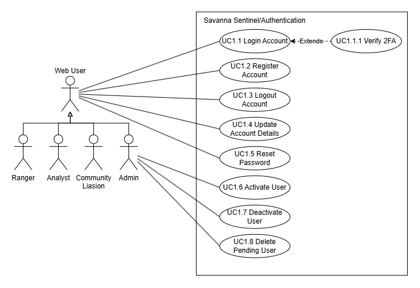
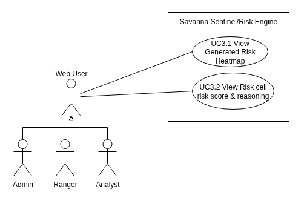
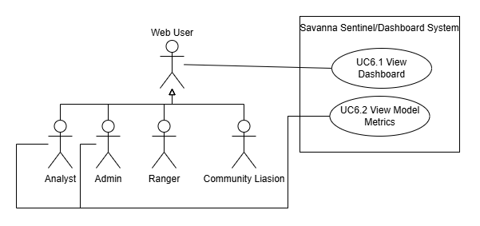
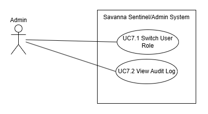
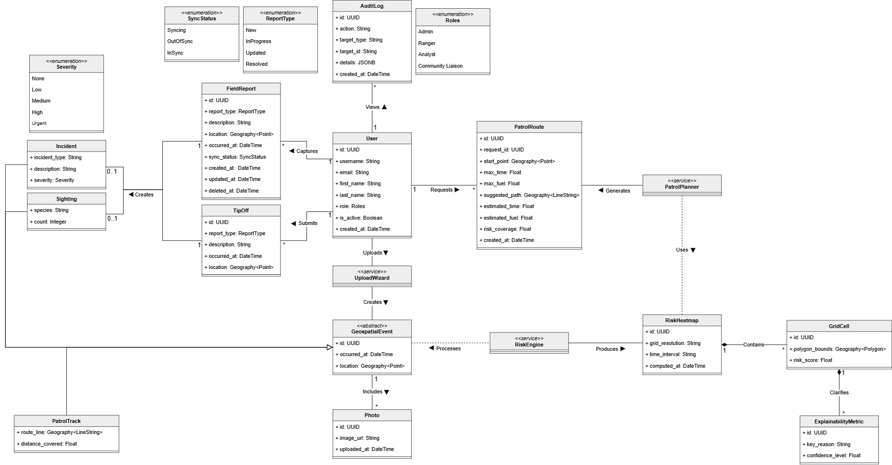

# SIGILL - Software Requirements Specifications

---

## Table of Contents

1. [Introduction](#1-introduction)
2. [User Stories](#2-user-stories)
3. [Use Cases](#3-use-cases)
4. [Functional Requirements](#4-functional-requirements)
5. [Non-Functional Requirements](#5-non-functional-requirements)
6. [Domain Model](#6-domain-model)

---

## 1. Introduction

### 1.1 Purpose

This Software Requirements Specification (SRS) defines the functional and non-functional requirements for **Savanna Sentinel**, a wildlife conservation anti-poaching intelligence platform. It serves as the authoritative requirements reference for the development team, the industry client EPI-USE, and university evaluators.

### 1.2 Scope

Savanna Sentinel enables game reserve rangers, analysts, and community liaisons to:

- Detect poaching hotspots through an AI-driven geospatial risk heatmap
- Plan optimal, constraint-based patrol routes
- Capture and sync field reports offline via a Progressive Web App (PWA)
- Submit community tip-offs about observed incidents or sightings
- Administer user accounts and monitor system activity via an audit log

The system is a multi-role web application with offline-first field capabilities, backed by a versioned REST API, a PostgreSQL/PostGIS database, and an asynchronous ML processing pipeline.

### 1.3 Product Perspective

Savanna Sentinel is a standalone web-based platform. It exposes a versioned REST API (`/v1/...`) consumed by a React PWA client. The system is containerised using Docker Compose and deployable to any Linux host via a single `docker compose up` command. An asynchronous Celery worker pipeline handles ML workloads independently of the API request cycle. All external traffic passes through a Caddy reverse proxy for automatic TLS termination.

### 1.4 Assumptions

- Admin accounts are provisioned directly at the database level. No API endpoint creates an Admin.
- The Resend SMTP relay (free tier, 100 emails/day) is sufficient for password reset email volume in the demo environment.
- A computed heatmap must exist before patrol route generation can proceed

### 1.5 Definitions and Acronyms

| Term                       | Definition                                                                                   |
| -------------------------- | -------------------------------------------------------------------------------------------- |
| **RBAC**             | Role-Based Access Control - access governed by the user's assigned role                      |
| **JWT**              | JSON Web Token - stateless, signed authentication token                                      |
| **PWA**              | Progressive Web App - web application with offline and installable capabilities              |
| **PostGIS**          | PostgreSQL extension for geospatial data types and spatial indexing                          |
| **SHAP**             | SHapley Additive exPlanations - ML model explainability framework                            |
| **MinIO**            | S3-compatible open-source object storage                                                     |
| **IndexedDB**        | Browser-native structured storage API used for offline data                                  |
| **Workbox**          | Google library for service worker and offline caching management                             |
| **Field Report**     | A ranger-submitted record of an observed incident or sighting                                |
| **Tip-off**          | A community liaison–submitted record of a suspected incident or sighting                    |
| **Geospatial Event** | A database entity with a geographic location and timestamp (Incident, Sighting, PatrolTrack) |
| **Soft-delete**      | Marking a record as deleted without physically removing it from the database                 |
| **JTI**              | JWT ID - a unique identifier embedded in a token used for revocation tracking                |
| **ASGI**             | Asynchronous Server Gateway Interface - Python async web server standard                     |
| **TLS**              | Transport Layer Security - protocol for encrypted network communication                      |

---

## 2. User Stories

### 2.1 Identity & Access Management

| ID    | User Story                                                                                                                                                                                | Acceptance Criteria                                                                                                                                                                                                                                                                                                                                                                                                                                                                                                                                                                 |
| :---- | :---------------------------------------------------------------------------------------------------------------------------------------------------------------------------------------- | :---------------------------------------------------------------------------------------------------------------------------------------------------------------------------------------------------------------------------------------------------------------------------------------------------------------------------------------------------------------------------------------------------------------------------------------------------------------------------------------------------------------------------------------------------------------------------------- |
| US1.1 | **As a** prospective user, **I want to** register for an account and select my intended role **so that** I can request the appropriate level of access once approved.   | * Form includes username, email, password, first name, last name, and a role selector. * Available roles to select are: Ranger, Analyst, Community Liaison. * Password must be at least 8 characters. * Account is created with`is_active: false` and cannot be used to log in until an Admin activates it. * Returns `201 Created` on success.                                                                                                                                                                                                             |
| US1.2 | **As an** Admin, **I want to** review and activate or deactivate user accounts **so that** I can control who has access to the system.                                  | * Admin can view a comprehensive list of all system users including those pending activation. * Admin can activate, deactivate, or update the role of any user account (excluding other admins).                                                                                                                                                                                                                                                                                                                                                                               |
| US1.3 | **As a** registered user, **I want to** log in with my credentials **so that** I receive a secure JWT session.                                                          | * System validates email and password. * Issues a signed JWT access token and refresh token on success. * Access token expires after 3600 seconds. * System restricts login to users where`is_active` is true. * Any failed login attempt returns a single vague `401` response that does not reveal whether the email exists, the password is wrong, or the account is inactive.                                                                                                                                                                           |
| US1.4 | **As an** authenticated user, **I want to** refresh my session **so that** I am not logged out while actively using the system.                                         | * Client can exchange a valid refresh token for a new access token. * Returns`401` if the refresh token is invalid or revoked.                                                                                                                                                                                                                                                                                                                                                                                                                                               |
| US1.5 | **As a** user, **I want to** update my profile and password **so that** my account information remains current and secure.                                              | * User can update first name and last name. * Password change requires`current_password` and `new_password`. * `new_password` must be at least 8 characters. * Password change revokes all existing refresh tokens.                                                                                                                                                                                                                                                                                                                                            |
| US1.6 | **As an** authenticated user, **I want to** log out of the system **so that** my session is securely invalidated.                                                       | * The current refresh token is revoked (`revoked_at` is set in the database). * Any subsequent request using the revoked token is rejected with `401 Unauthorised`. * The access token is discarded client-side on logout.                                                                                                                                                                                                                                                                                                                                            |
| US1.7 | **As a** registered user, **I want to** reset my password via email **so that** I can regain access to my account if I forget my credentials.                           | * User submits their registered email address to initiate a reset. * A time-limited, single-use password reset link is sent to the provided address. * Following the link allows the user to set a new password without knowing the current one. * The reset token is invalidated after use or after expiry.                                                                                                                                                                                                                                                         |
| US1.8 | **As an** Admin, **I want to** view an audit log of administrator-level actions **so that** I can monitor system access and detect unauthorised activity.               | * Audit log displays each entry's actor, action performed, target record type and ID, and timestamp. * Log entries are read-only and cannot be modified or deleted.                                                                                                                                                                                                                                                                                                                                                                                                            |
| US1.9 | **As an** Admin, **I want to** reject and permanently delete a pending user application **so that** unauthorised or unwanted registrations are removed from the system. | * Admin can permanently delete any user account that is in an inactive (pending) state. * Active accounts cannot be deleted; the Admin must first deactivate the account before deletion is permitted. * Deletion permanently removes the user record and all associated tokens (refresh tokens, password reset tokens) - no soft-delete. * Admin accounts cannot be deleted via this action. * The deletion is recorded in the audit log (actor, action, target user ID, timestamp) before the record is removed. * Returns`204 No Content` on success. |

---

### 2.2 Data Ingestion & Geospatial Management

| ID    | User Story                                                                                                                                                           | Acceptance Criteria                                                                                                                                                                                                                                                                                                       |
| :---- | :------------------------------------------------------------------------------------------------------------------------------------------------------------------- | :------------------------------------------------------------------------------------------------------------------------------------------------------------------------------------------------------------------------------------------------------------------------------------------------------------------------ |
| US2.1 | **As an** Analyst, **I want to** upload CSV files of historical data **so that** the risk engine has data to process.                              | * Supports types:`incidents`, `patrol_tracks`, `sightings`, and `tipoffs`. * File is stored and a background processing job is queued. * Validated data is persisted to PostgreSQL with PostGIS spatial indexing.                                                                                       |
| US2.2 | **As an** Analyst, **I want to** use a data upload wizard with previews and validation errors **so that** I can fix data issues before committing. | * Wizard invokes the`/v1/ingestion/validate` endpoint to display a data preview and report errors before the user proceeds to final upload. * Displays friendly, human-readable validation errors per row. * Final upload is only triggered via the upload wizard once the user confirms the data is correct. |

---

### 2.3 Risk Engine & Visualization

| ID    | User Story                                                                                                                                                                         | Acceptance Criteria                                                                                                                                                                                                                                                                                   |
| :---- | :--------------------------------------------------------------------------------------------------------------------------------------------------------------------------------- | :---------------------------------------------------------------------------------------------------------------------------------------------------------------------------------------------------------------------------------------------------------------------------------------------------- |
| US3.1 | **As a** Ranger or Analyst, **I want to** view a heatmap of high-risk areas **so that** I can identify poaching hotspots.                                        | * Heatmap layer indicates high-risk areas based on AI Risk Engine scores. * Provides an interactive time range slider to observe changes across intervals. * Heatmap updates within 1 second of a new slider position. * Includes interactive map controls, legends, and data filters. |
| US3.2 | **As a** Ranger or Analyst, **I want to** see the reasoning behind a risk score **so that** I can understand why an area is marked high-risk.                    | * Explainability panel communicates the specific feature contributions for a selected cell. * Clearly presents confidence levels without overclaiming model certainty.                                                                                                                           |
| US3.3 | **As a** Ranger or Analyst, **I want** the map to display only data my role is authorised to access **so that** I am not exposed to data outside my permissions. | * All map data is served via authenticated API endpoints with server-side RBAC enforcement. * Access restrictions are applied per endpoint regardless of client state. * No unauthorised data is returned in any API response.                                                              |

---

### 2.4 Field Operations & Offline PWA

| ID    | User Story                                                                                                                                                                                               | Acceptance Criteria                                                                                                                                                                                                                                                                                                                                                                                                                                                                                                                                                                                                                                                                                                               |
| :---- | :------------------------------------------------------------------------------------------------------------------------------------------------------------------------------------------------------- | :-------------------------------------------------------------------------------------------------------------------------------------------------------------------------------------------------------------------------------------------------------------------------------------------------------------------------------------------------------------------------------------------------------------------------------------------------------------------------------------------------------------------------------------------------------------------------------------------------------------------------------------------------------------------------------------------------------------------------------- |
| US4.1 | **As a** Ranger, **I want to** submit field reports offline via the PWA **so that** I can capture data in areas without connectivity.                                                  | * PWA interface supports offline data capture for incidents and sightings. * All reports capture: report type (incident or sighting), location (lat/lon),`occurred_at`, and description. * Incident reports additionally capture incident type and severity level (low / medium / high). * Sighting reports additionally capture species name and an optional animal count. * Each submitted field report creates a corresponding geospatial event of the matching type. * Reports are stored locally in IndexedDB when offline. * Reports sync automatically to the server within 60 seconds of connectivity being restored. * Supports optional photo uploads to MinIO via pre-signed URL. |
| US4.2 | **As a** Ranger, **I want to** edit and delete my field reports **so that** I can correct mistakes and manage my submissions.                                                          | * Ranger can edit the common fields of their own reports: description, location,`occurred_at`, and photos. * For incident reports, the ranger can additionally edit incident type and severity level. * For sighting reports, the ranger can additionally edit species name and animal count. * Edits made offline are stored locally and synced on reconnection. * Ranger can delete their own reports; deleted reports are soft-deleted and no longer visible in the UI. * A Ranger cannot edit or delete another Ranger's reports. * Changes are reflected in the UI immediately after submission.                                                                                             |
| US4.3 | **As a** Ranger, **I want to** generate optimal patrol routes based on risk and resource constraints **so that** I can patrol safely and efficiently.                                  | * Planner accepts starting point, maximum patrol time, and fuel constraint as inputs. * System consumes the Risk Heatmap to propose routes prioritising high-risk coverage. * System generates multiple alternative routes per planning request, grouped by a shared request ID. * Provides a side-by-side route comparison interface showing risk coverage, estimated time, and estimated fuel consumption for each alternative. * Route suggestions are returned within 5 seconds.                                                                                                                                                                                                                          |
| US4.4 | **As a** Ranger or Analyst, **I want to** view my previously generated patrol routes **so that** I can review past plans without regenerating them.                                    | * Authenticated Rangers and Analysts can retrieve a list of their own previously generated patrol route requests, grouped by request ID. * Each route record displays its start point, resource constraints, suggested path, risk coverage, estimated time, and estimated fuel consumption.                                                                                                                                                                                                                                                                                                                                                                                                                                  |
| US4.5 | **As a** Ranger, **I want** my offline field reports to sync without silent data loss **so that** I can trust that what I captured in the field is accurately reflected in the system. | * When connectivity is restored, all locally queued reports are automatically submitted to the server. * If a report was edited both offline and on the server, the conflict is resolved deterministically - no record is silently overwritten. * Soft-deleted records made offline are correctly propagated; they do not reappear after sync. * The Ranger is not required to take any manual action to trigger or resolve a sync.                                                                                                                                                                                                                                                                                |
| US4.6 | **As an** Admin, **I want to** edit or delete any field report **so that** I can correct data quality issues and manage submissions across all rangers.                                | * Admin can edit the common fields (description, location,`occurred_at`, photos) of any field report regardless of who submitted it. * For incident reports, the Admin can additionally edit incident type and severity level. * For sighting reports, the Admin can additionally edit species name and animal count. * Admin can soft-delete any field report; deleted reports are retained for audit purposes but are no longer visible in the UI.                                                                                                                                                                                                                                                             |

---

### 2.5 Community Tip-off

| ID    | User Story                                                                                                                                                                    | Acceptance Criteria                                                                                                                                                                                                                                                                                                                                                                                                                                                  |
| :---- | :---------------------------------------------------------------------------------------------------------------------------------------------------------------------------- | :------------------------------------------------------------------------------------------------------------------------------------------------------------------------------------------------------------------------------------------------------------------------------------------------------------------------------------------------------------------------------------------------------------------------------------------------------------------- |
| US5.1 | **As a** Community Liaison, **I want to** submit a tip-off about a suspected incident or sighting **so that** rangers can be informed of potential threats. | * Form captures report type (incident or sighting), location,`occurred_at`, description, and optional photos. * Incident tip-offs additionally capture incident type and severity level. * Sighting tip-offs additionally capture species name and optional animal count. * `occurred_at` must not be in the future. * Submission is associated with the authenticated Community Liaison account. * Returns `201 Created` on success. |

---

### 2.6 Dashboards & Analytics

| ID    | User Story                                                                                                                                                                                    | Acceptance Criteria                                                                                                                                   |
| :---- | :-------------------------------------------------------------------------------------------------------------------------------------------------------------------------------------------- | :---------------------------------------------------------------------------------------------------------------------------------------------------- |
| US6.1 | **As an** Analyst or Admin, **I want to** view operational dashboard cards **so that** I can monitor patrol coverage, field report trends, and system activity at a glance. | * Dashboard displays cards for patrol coverage, field report counts, and recent trends. * Data is up to date with the latest synced records.     |
| US6.2 | **As an** Analyst, **I want to** view basic model performance metrics **so that** I can assess the reliability of the AI Risk Engine.                                       | * Dashboard displays model performance metrics such as accuracy indicators. * Metrics are clearly labelled and do not overclaim model certainty. |

---

## 3. Use Cases

This is a summarised version of the Use Cases document. For more information, please review the [Use Cases](../use-cases/use_case_scopes.md), this includes additional details such as when the use case starts and ends.

### 3.1 Authentication Subystem

**NOTE:** This subsystem is included for completeness, even if they do not count towards the total use case count

### 3.2 Ingestion Subsystem

### 3.3 Risk Subsystem

### 3.4 Field Report and Routes Subsystem

### 3.5 Tip-off Subsystem

### 3.6 Dashboard Subsystem

### 3.7 Admin Subsystem

## 4. Functional Requirements

Dedicated Functional Requiremnts document [here](../functional-requirements/FunctionalRequirements.md)

### 4.1 - R1: User Access and Security Management

*Subsystem: Auth Identity System*

#### 4.1.1 - R1.1: Role Based Access Control (RBAC)

- **R1.1.1:** The system will support role-based access control with predefined roles including Ranger, Analyst, Community Liaison and Admin.
- **R1.1.2:** The system will enforce server-side authentication using stateless sessions (JWT).
- **R1.1.3:** The system will restrict access to specific views, features, and map layers based on the authenticated user’s assigned role.

#### 4.1.2 - R1.2: Audit and Security

- **R1.2.1:** The system will maintain an audit log of all administrator-level actions, recording the actor’s user ID, action performed, target record type and ID, and a timestamp
- **R1.2.2:** The audit log shall be readable only by Admins.
- **R1.2.3:** The audit log shall be immutable, no user, including Admins, shall be able to edit or delete an existing audit log entry.
- **R1.2.4:** The system will ensure all data in transit is encrypted via HTTPS.

---

### 4.2 - R2: Data Ingestion and Validation

*Subsystem: Data Ingestion Subsystem*

#### 4.2.1 - R2.1: File Upload and Parsing

- **R2.1.1:** The system will allow Analysts to upload CSV files containing historical data.
- **R2.1.2:** The system will provide a data upload wizard that displays a preview of the uploaded data prior to commit.
- **R2.1.3:** The data upload wizard will display human-readable validation errors for any row that fails validation, without committing any data until the Analyst confirms the import.
- **R2.1.4:** The system will parse and translate uploaded data into core entities including: Incidents, Patrol Tracks, Sightings, and Tip-offs.

#### 4.2.2 - R2.2: Geospatial Storage

- **R2.2.1:** The system will persist validated geospatial data with spatial indexing to support efficient location-based querying.

---

### 4.3 - R3: Geospatial Risk Engine and Visualization

*Subsystem: Geospatial Risk Engine Subsystem*

#### 4.3.1 - R3.1: Risk Engine Processing

- **R3.1.1:** The AI Risk Engine will process historical data via asynchronous background jobs to compute risk scores, such that the requesting user is not blocked while scores are calculated.
- **R3.1.2:** The Risk Engine will calculate risk hotspots gridded into geographic cells.
- **R3.1.3:** The Risk Engine will compute a distinct risk score per geographic cell for each defined time interval.

#### 4.3.2 - R3.2: Interactive Map

- **R3.2.1:** The system will display a heatmap layer on the map indicating high-risk areas based on the calculated risk scores.
- **R3.2.2:** The system will provide an interactive time range slider allowing users to select a time interval and view its corresponding risk hotspots
- **R3.2.3:** The system will provide interactive map controls including a legend describing the heatmap scale.
- **R3.2.4:** The system will provide interactive data filters allowing users to filter map layers by record type (e.g Incidents, Sightings, Tip-offs)
- **R3.2.5:** The system will enforce role-based access control on all map data API endpoints, such that each role receives only the data it is authorised to access as defined by the RBAC policy.

---

### 4.4 - R4: Risk Engine Explainability

*Subsystem: Risk Explainability Subsystem*

#### 4.4.1 - R4.1: Explainability Metrics

- **R4.1.1:** The Risk Engine will generate explainability metrics using SHAP for each computed risk score.
- **R4.1.2:** The generated explainability metrics will detail the contribution of each input feature to the resulting risk score.

#### 4.4.2 - R4.2: Explainability Panel

- **R4.2.1:** The system will provide an explainability UI panel that communicates the specific reasons a geographic cell is designated as high risk.
- **R4.2.2:** The explainability UI will display a confidence level for each risk score.
- **R4.2.3:** The explainability UI’s confidence level display must not overclaim model certainty (e.g. must not present a score as a guarantee of an event occurring)

---

### 4.5 - R5: Patrol Route Planning

*Subsystem: Patrol Planning Subsystem*

#### 4.5.1 - R5.1: Constraint-Based Route Generation

- **R5.1.1:** The Patrol Planner will accept custom user parameters, including starting point, maximum time allowed and fuel usage constraints.
- **R5.1.2:** The Patrol Planner will consume the current Risk Heatmap and the supplied resource constraints to generate multiple alternative patrol routes per planning request.
- **R5.1.3:** All route alternatives generated from a single planning request will share a common request ID and will be returned together to the requesting user.

#### 4.5.2 - R5.2: Route Retrieval

- **R5.2.1:** The system will allow authenticated Rangers and Analysts to retrieve their previously generated patrol route requests.
- **R5.2.2:** Retrieved route alternatives will be grouped by their shared request ID.

#### 4.5.3 - R5.3: Route Evaluation

- **R5.3.1:** The system will provide a side-by-side route comparison interface allowing rangers to evaluate proposed routes.
- **R5.3.2:** The route comparison interface will display, for each route option, the estimated risk coverage, estimated time and estimated fuel consumption.

---

### 4.6 - R6: Field Reporting and Offline Sync

*Subsystem: Field Reporting Subsystem*

#### 4.6.1 - R6.1: Mobile Offline Capture

- **R6.1.1:** The system will provide a Progressive Web App (PWA) interface for rangers to capture Field Reports.
- **R6.1.2:** The system will allow Rangers to input field report data locally on the device when operating without network connectivity.
- **R6.1.3:** A Ranger may submit multiple field reports during a single patrol.
- **R6.1.4:** Each field report shall be classified as either an incident report or a sighting report.
- **R6.1.5:** An incident report shall capture an incident type and a severity level, in addition to the common fields.
- **R6.1.6:** A sighting report shall capture a species name and an optional animal count, in addition to the common fields.
- **R6.1.7:** Each submitted field report will create a corresponding geospatial event of the matching type (Incident or Sighting).
- **R6.1.8:** Offline field report data shall be persisted to the device using IndexedDB until synchronisation occurs.
- **R6.1.9:** The system will optionally support capturing photo evidence associated with a field report.
- **R6.1.10:** The system will upload captured photo evidence to S3-compatible storage (MinIO) via pre-signed URLs.

#### 4.6.2 - R6.2: Field Report Management

- **R6.2.1:** The system will allow Rangers to edit their own previously submitted field reports, both online and offline.
- **R6.2.2:** For all field reports, the editable common fields are description, location, occurred_at and associated photos.
- **R6.2.3:** For incident reports specifically, incident type and severity shall additionally be editable.
- **R6.2.4:** For sighting reports specifically, species and count shall additionally be editable.
- **R6.2.5:** The system will allow Rangers to delete their own previously submitted field reports.
- **R6.2.6:** Deleted field reports will be soft-deleted and retained in the database for audit purposes.
- **R6.2.7:** The system will allow Admins to edit any field report regardless of the submitting Ranger, with the same field-level permissions defined in R6.2.2–R6.2.4.
- **R6.2.8:** The system will allow Admins to delete any field report regardless of the submitting Ranger.

#### 4.6.3 - R6.3: Synchronisation and Conflict Handling

- **R6.3.1:** The system will allow Admins to delete any field report regardless of the submitting Ranger.
- **R6.3.2:** The Sync Service will detect database conflicts arising from offline data uploads and offline deletions.
- **R6.3.3:** The Sync Service will resolve detected conflicts deterministically, such that no record is silently overwritten.
- **R6.3.4:** Soft-deleted records created offline shall be correctly propagated to the central database upon sync.

---

### 4.7 - R7: Community Tip-off Submission

*Subsystem: Community Tip-off Subsystem*

#### 4.7.1 - R7.1: Tip-off Capture

- **R7.1.1:** The system will allow Community Liaisons to submit tip-offs describing an observed incident or sighting.
- **R7.1.2:** Every tip-off shall capture report type, location, occurred_at and description.
- **R7.1.3:** The system will optionally allow photo evidence to be attached to a tip-off.
- **R7.1.4:** An incident tip-off shall additionally capture an incident type and a severity level.
- **R7.1.5:** A sighting tip-off shall additionally capture a species name and an optional animal count.
- **R7.1.6:** The system will reject a tip-off submission if the occurred_at field is set to a future date or time.
- **R7.1.7:** The system will associate each submitted tip-off with the submitting Community Liaison’s user account.

---

### 4.8 - R8: Dashboards and System Analytics

*Subsystem: Analytics & Dashboard Subsystem*

#### 4.8.1 - R8.1: Operational Dashboards

- **R8.1.1:** The system will display dashboard cards summarising patrol coverage
- **R8.1.2:** The system will display dashboard cards summarising Field Report findings.
- **R8.1.3:** The system will display dashboard cards summarising operational trends over time.
- **R8.1.4:** The system will display basic model performance metrics to Analysts.
- **R8.1.5:** Displayed model performance metrics shall be clearly labelled and must not overclaim model certainty.

---

### 4.9 - R9: Account and Identity Management

*Subsystem: Account & Identity Management Subsystem*

#### 4.9.1 - R9.1: Authentication Flow

- **R9.1.1:** The system will allow only activated user accounts to log in.
- **R9.1.2:** The system will deny login access to accounts pending Admin activation.
- **R9.1.3:** The system will return a deliberately vague error response for any failed login attempt, such that the response does not reveal whether the email address exists, the password is incorrect or the account is inactive.
- **R9.1.4:** The system will allow users to log out, securely invalidating their current active session.
- **R9.1.5:** The system will allow clients to obtain a new access token using a valid, non-revoked refresh token without requiring the user to log in again.
- **R9.1.6:** The system will return a 401 Unauthorised response if a client attempts to use an invalid or revoked refresh token.
- **R9.1.7:** The system will provide a password recovery mechanism whereby a user submits their registered email address and the system sends a time-limited, single-use password reset link to that address.
- **R9.1.8:** Following a valid password reset link will allow the user to set a new password without providing their current one.
- **R9.1.9:** The system will invalidate a password reset token after its first use or after its expiry, whichever occurs first.
- **R9.1.10**: The system will request a pin to be entered that will be sent to the user’s email when the account is identified to have admin role permissions

#### 4.9.2 - R9.2: User Registration

- **R9.2.1:** The system will allow prospective users to register for an account by providing a username, email address, password, first name and last name.
- **R9.2.2:** At registration, the system will require the prospective user to select their intended role from the available options: Ranger, Analyst, or Community Liaison.
- **R9.2.3:** All newly registered accounts will be created in an inactive state.
- **R9.2.4:** The system will require explicit activation by an Admin before a newly registered user can log in.

#### 4.9.3 - R9.3: User Account Administration

- **R9.3.1:** The system will allow an Admin to view a comprehensive list of all system users and their current statuses, including pending activation requests.
- **R9.3.2:** The system will allow an Admin to activate a user account.
- **R9.3.3:** The system will allow an Admin to deactivate a user account.
- **R9.3.4:** The system will allow an Admin to modify the role of any non-Admin user account.
- **R9.3.5:** The system will prevent any Admin from activating, deactivating, or modifying the role of an account that holds the Admin role.
- **R9.3.6:** The system will allow an Admin to permanently delete a user account that is in an inactive (pending) state.
- **R9.3.7:** The system will prevent the deletion of any user account that is in an active state, an Admin must first deactivate an account before deletion is permitted.
- **R9.3.8:** Upon deletion, the system will permanently remove the user record and all associated tokens (refresh tokens, password reset tokens) from the database, with no soft-delete applied.
- **R9.3.9:** The system will prevent any Admin from deleting an account that holds the Admin role.
- **R9.3.10:** The system will record a user account deletion in the audit log, including actor ID, action, target user ID, and timestamp, before the record is removed.

#### 4.9.4 - R9.4: Profile Management

- **R9.4.1:** The system will allow users to view their own basic profile information.
- **R9.4.2:** The system will allow users to update their own basic profile information.
- **R9.4.3:** The system will allow users to securely update their own password.
- **R9.4.4:** A password change request shall require the user’s current password for verification before the change is accepted.
- **R9.4.5:** On a successful password change, the system will revoke all existing refresh tokens associated with that account.

---

### 4.10 - R10: General Application Features

*Subsystem: Core Application Services Subsystem*

#### 4.10.1 - R10.1: Data Entry and Validation

- **R10.1.1:** The system will enforce client-side form validation on all user inputs.
- **R10.1.2:** The system will enforce server-side form validation on all user inputs, independent of client-side validation, to prevent malformed data
- **R10.1.3:** The system will require user passwords to be a minimum of 8 characters in length.
- **R10.1.4:** The system will display clear, human-readable error messages when form validation fails.

---

## 5. Non-Functional Requirements

Dedicated Non-Functional Requiremnts document [here](<../non-functional/Non%20Functional%20Requirements.md>)

### 5.1 Core Non-Functional Requirements

Our system targets the following non-functional requirements

- **Security:** All sensitive user data should be encrypted using AES-256 encryption, and the system should enforce multi-factor authentication for administrative accounts.
- **Reliability:** The system should achieve 99.9% uptime and recover from critical failures within 5 minutes.
- **Performance:** The system should respond to user requests within 2 seconds for 95% of requests under normal operating conditions and support at least 60 concurrent users.
- **Availability:** The system should be available 24/7, excluding scheduled maintenance periods not exceeding 2 hours per month.
- **Maintainability:** New features or bug fixes should be deployable within 2 hours, and the codebase should maintain at least 80% automated test coverage

### 5.2 Quantifications

#### 5.2.1 Security

Mozilla HTTP Observatory Badge on the main README page.

#### 5.2.2 Reliability

Uptime Badge on the main README page

#### 5.2.3 Performance

K6 Performance test with ~90 Concurrent users performing various tasks in estimated distributions, with a badge on the main README stating the p(95) response time

#### 5.2.4 Availability

**Insert Quantification Here**

#### 5.2.5 Maintainability

**Insert Quantification Here**

---

## 6. Domain Model

Original image can be found in the domain folder of the docs.

