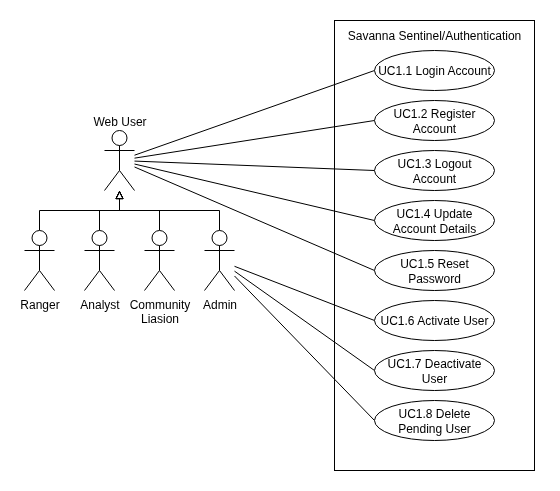
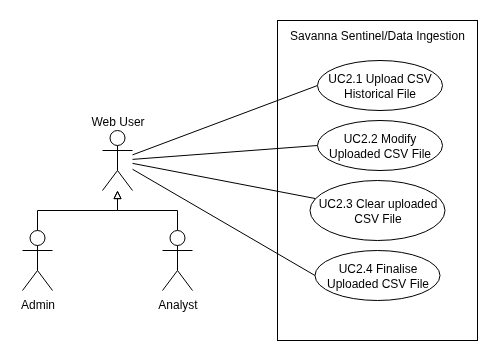
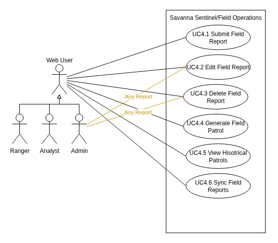
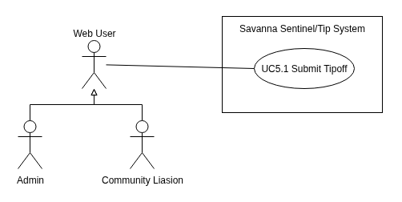
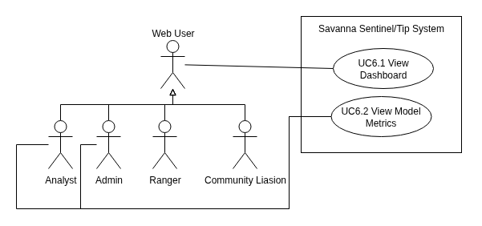

# SIGILL USE CASE DOCUMENT

---

## Acrnoyms Used

- TUCBW - This Use Case Begins With
- TUCEW - This Use Case Ends With

---

## Use Cases

---

### Subsystem 1: Authentication

**NOTE:** This subsystem is included for completeness, even if they do not count towards the total use case count

#### Image

#### Use Case Scope

| Use Case Number               | Starts With/Ends With                                                                                                                                                                                                                                                                         |
| ----------------------------- | --------------------------------------------------------------------------------------------------------------------------------------------------------------------------------------------------------------------------------------------------------------------------------------------- |
| UC1.1 Login Account           | TUCBW the user is being shown the login screen upon enterring the website.  TUCEW the user being shown a confirmation message and being redirected to the dashboard.                                                                                                                     |
| UC1.2 Register Account        | TUCBW the user clicking the "Register Account" button on the login screen.  TUCEW the user being shown a confirmation message and being told to initiate UC1.1.                                                                                                                          |
| UC 1.3 Logout Account         | TUCBW the user clicking the Logout button on the navigation burger menu.  TUCEW the user being shown the login screen.                                                                                                                                                                   |
| UC 1.4 Update Account Details | TUCBW the user entering the submission details and clicking the submit button  TUCEW the user being informed their details have been updated. **ALT:** TUCEW the user being redirected to the login screen, only if their password has changed.                                    |
| UC 1.5 Reset password         | TUCBW the user clicking the reset password button on the login screen  TUCEW the user entering their new password on the magic link and being redirected to login                                                                                                                        |
| UC 1.6 Activate User          | TUCBW the admin clicking the activate button next to the corresponding pending user  TUCEW the admin being shown a confirmation message, and the user being sent a welcome email.                                                                                                        |
| UC 1.7 Deactivate User        | TUCBW the admin clicking the deactivate button next to the corresponding active user  TUCEW the admin being shown a confirmation message, and the user being sent a deactivation email. Important to note the account is not removed from the DB, just access to the service is revoked. |
| UC 1.8 Delete Pending User    | TUCBW the admin clicking the reject button next to the corresponding pending user.  TUCEW with the admin being shown a confirmation message, and the user being sent a rejection email.                                                                                                  |

---

### Subsytem 2: Ingestion

#### Image

#### Use case scope

| Use Case Number                  | Starts With/Ends With                                                                                                                                                                                              |
| -------------------------------- | ------------------------------------------------------------------------------------------------------------------------------------------------------------------------------------------------------------------ |
| UC2.1 Upload CSV Historical File | TUCBW the user clicking the upload file button and choosing a csv file to upload.  TUCEW the system displaying the parsed CSV file and any errors that it could not remedy.                                   |
| UC2.2 Modify Uploaded CSV File   | TUCBW the user selecting a malformed record from the uploaded file.  TUCEW the system confirming the new details are parseable and in a valid format.                                                         |
| UC2.3 Clear Uploaded CSV File    | TUCBW the user clicking the clear button, after uploading a CSV file.  TUCEW the user being redirected to the beginning of UC2.1.                                                                             |
| UC2.4 Finalise Uploaded CSV File | TUCBW the user clicking the Upload button.  TUCEW the system confirming the file has been uploaded to the database to be analysed by the risk engine, and the user being redirected to the beginning of UC2.1 |

---

### Subsystem 3: Risk

#### Image

#### Use Case Scope

| Use Case Number                              | Starts With/Ends With                                                                                                                                   |
| -------------------------------------------- | ------------------------------------------------------------------------------------------------------------------------------------------------------- |
| UC3.1 View Generated Risk Heatmap            | TUCBW the user entering the map screen.  TUCEW the user being presented the most recent heatmap their role permits generated by the AI risk engine |
| UC 3.2 View Risk cell risk score & reasoning | TUCBW the user clicking a cell on the map.  TUCEW with the user being presented information generated by the AI risk engine on the selected cell.  |

---

### Subsystem 4: Field Reports and Routes

#### Image

#### Use Case Scope

| Use Case Number               | Starts With/Ends With                                                                                                                                                                       |
| ----------------------------- | ------------------------------------------------------------------------------------------------------------------------------------------------------------------------------------------- |
| UC4.1 Submit Field Report     | TUCBW the user clicking the submit report button.  TUCEW the field report being submitted to the system or being queued for upload                                                     |
| UC4.2 Edit Field Report       | TUCBW the user selecting a pending, unuploaded, submitted field report.  TUCEW the pending field report being updated and the user being notified.                                     |
| UC4.3 Delete Field Report     | TUCBW the user selecting a pending, unuploaded, submitted field report and clicking the delete button.  TUCEW the user being notified the field report is no longer queued for upload. |
| UC4.4 Generate Field Patrol   | TUCBW the user clicking the generate patrol on the risk heatmap.  TUCEW the user being shown potential routes for the patrol.                                                          |
| UC4.5 View Historical Patrols | TUCBW the user**UNKNOWN FILL IN**   TUCEW the user being shown their previous generated patrol routes.                                                                           |
| UC4.6 Sync Field Reports      | TUCBW automatically, or the user pressing the sync button.  TUCEW the user being notified that all pending field reports have been uploaded.                                           |

---

### Subsystem 5: Tip-off

#### Image

#### Use Case Scope

| Use Case Number     | Starts With/Ends With                                                                                                                                                                      |
| ------------------- | ------------------------------------------------------------------------------------------------------------------------------------------------------------------------------------------ |
| UC5.1 Submit Tipoff | TUCBW the user entering tip off details and clicks the submit button.  TUCEW the user being informed that a tip off has been made, and that it will be processed by the risk engine. |

---

### Subsystem 6: Dashboard

#### Image

#### Use Case Scope

| Use Case Number          | Starts With/Ends With                                                                                                            |
| ------------------------ | -------------------------------------------------------------------------------------------------------------------------------- |
| UC6.1 View Dashboard     | TUCBW the user viewing the dashboard page.  TUCEW the user being presented their respective role's dashboard.               |
| UC6.2 View Model Metrics | TUCBW with the user expanding the model section on the dashboard.  TUCEW the user being shown the risk engines performance. |

---

## Changelog

### V2 (Demo 1 -> V2)

- Refactored entire diagram to match feedback
- Introduced use case scope
- Separated use cases into more distinct subsystems
- Partitioned actors into roles to make the diagram cleaner
- Removed the following use cases
  - Refresh Session - No Actor is involved with this use case, it is an automated action that the user is unaware of.
  - View Role Filtered Map Data - Was merged into View Map Data
  - Edit Any Report / Delete Any Report - Merged into Edit and Delete Own Report
- Updated the following use cases
  - Reset Password via Email -> Reset Password - Simpler name that does not restrict the method as much, details can be added in other documentation.
  - Activate / Deactive User -> Split into 2 use cases - These have different outcomes internally
  - Split US2 into various use cases to make them more granular, and added scope to help detail the process, as requested from feedback
- Minor improvements
