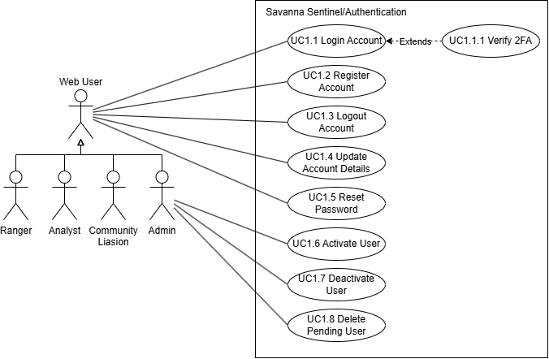
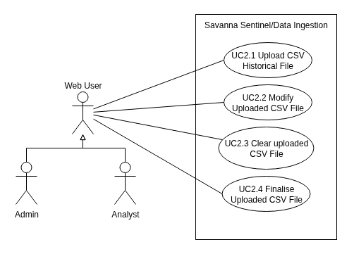
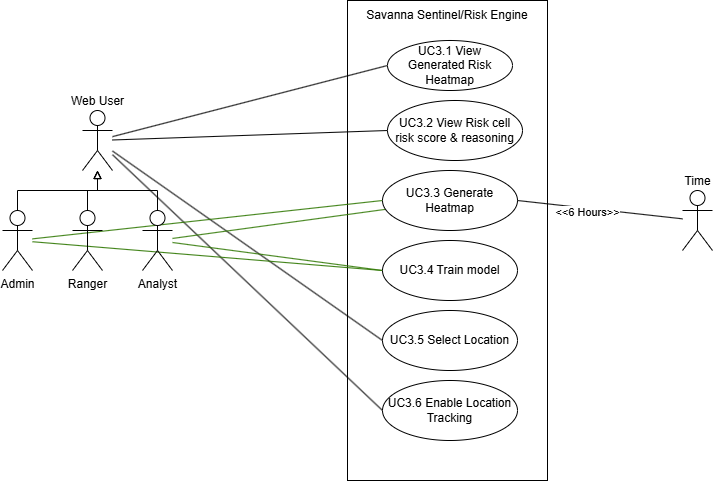
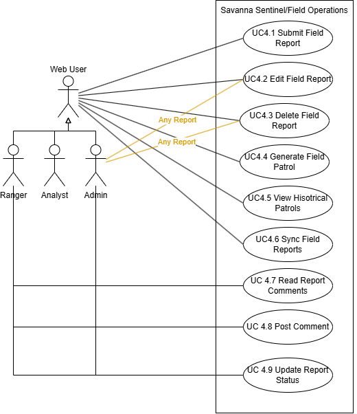
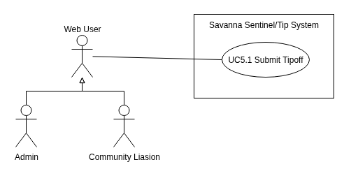
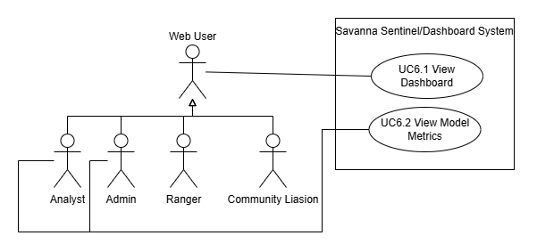
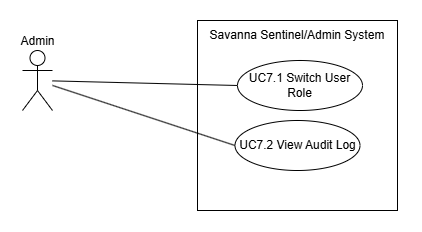
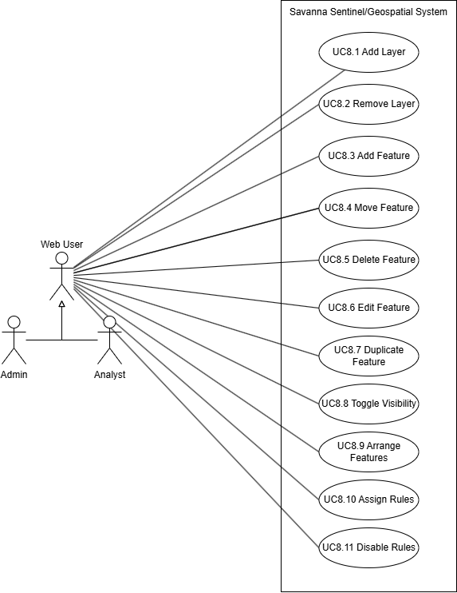

# SIGILL USE CASE DOCUMENT

---

## Acrnoyms Used

- TUCBW - This Use Case Begins With
- TUCEW - This Use Case Ends With

---

## Use Cases

---

### Subsystem 1: Authentication

**NOTE:** This subsystem is included for completeness, even if they do not count towards the total use case count

#### Image

#### Use Case Scope

| Use Case Number               | Starts With/Ends With                                                                                                                                                                                                                                                                                                                                                     |
| ----------------------------- | ------------------------------------------------------------------------------------------------------------------------------------------------------------------------------------------------------------------------------------------------------------------------------------------------------------------------------------------------------------------------- |
| UC1.1 Login Account           | TUCBW the user is being shown the login screen upon enterring the website.  TUCEW the user being shown a confirmation message and being redirected to the dashboard.  UC 1.1.1 If the user is an admin, extend to Verify 2FA TUCBW the user being prompted to enter a code to continue TUCEW the user entered the code and continuing with UC1.1 |
| UC1.2 Register Account        | TUCBW the user clicking the "Register Account" button on the login screen.  TUCEW the user being shown a confirmation message and being told to initiate UC1.1.                                                                                                                                                                                                      |
| UC 1.3 Logout Account         | TUCBW the user clicking the Logout button on the navigation burger menu.  TUCEW the user being shown the login screen.                                                                                                                                                                                                                                               |
| UC 1.4 Update Account Details | TUCBW the user entering the submission details and clicking the submit button  TUCEW the user being informed their details have been updated. **ALT:** TUCEW the user being redirected to the login screen, only if their password has changed.                                                                                                                |
| UC 1.5 Reset password         | TUCBW the user clicking the reset password button on the login screen  TUCEW the user entering their new password on the magic link and being redirected to login                                                                                                                                                                                                    |
| UC 1.6 Activate User          | TUCBW the admin clicking the activate button next to the corresponding pending user  TUCEW the admin being shown a confirmation message, and the user being sent a welcome email.                                                                                                                                                                                    |
| UC 1.7 Deactivate User        | TUCBW the admin clicking the deactivate button next to the corresponding active user  TUCEW the admin being shown a confirmation message, and the user being sent a deactivation email. Important to note the account is not removed from the DB, just access to the service is revoked.                                                                             |
| UC 1.8 Delete Pending User    | TUCBW the admin clicking the reject button next to the corresponding pending user.  TUCEW with the admin being shown a confirmation message, and the user being sent a rejection email.                                                                                                                                                                              |

---

### Subsytem 2: Ingestion

#### Image

#### Use case scope

| Use Case Number                  | Starts With/Ends With                                                                                                                                                                                              |
| -------------------------------- | ------------------------------------------------------------------------------------------------------------------------------------------------------------------------------------------------------------------ |
| UC2.1 Upload CSV Historical File | TUCBW the user clicking the upload file button and choosing a csv file to upload.  TUCEW the system displaying the parsed CSV file and any errors that it could not remedy.                                   |
| UC2.2 Modify Uploaded CSV File   | TUCBW the user selecting a malformed record from the uploaded file.  TUCEW the system confirming the new details are parseable and in a valid format.                                                         |
| UC2.3 Clear Uploaded CSV File    | TUCBW the user clicking the clear button, after uploading a CSV file.  TUCEW the user being redirected to the beginning of UC2.1.                                                                             |
| UC2.4 Finalise Uploaded CSV File | TUCBW the user clicking the Upload button.  TUCEW the system confirming the file has been uploaded to the database to be analysed by the risk engine, and the user being redirected to the beginning of UC2.1 |

---

### Subsystem 3: Risk

#### Image

#### Use Case Scope

| Use Case Number                              | Starts With/Ends With                                                                                                                                                                                      |
| -------------------------------------------- | ---------------------------------------------------------------------------------------------------------------------------------------------------------------------------------------------------------- |
| UC3.1 View Generated Risk Heatmap            | TUCBW the user entering the map screen.  TUCEW the user being presented the most recent heatmap their role permits generated by the AI risk engine                                                    |
| UC 3.2 View Risk cell risk score & reasoning | TUCBW the user clicking a cell on the map.  TUCEW with the user being presented information generated by the AI risk engine on the selected cell.                                                     |
| UC 3.3 Generate Heatmap                      | TUCBW the user clicking the generate heatmap button, or when 6 hours have elapsed. TUCEW a new heatmap being generated with parameters found in the system and being displayed to the user.           |
| UC 3.4 Train Model                           | TUCBW the user clicking the train model button. TUCEW a new ai model being trained to read the parameters on the system.                                                                              |
| UC 3.5 Select Location                       | TUCBW the user enabling location and the application being unable to determine a previously known location of the user. TUCEW the user selecting a POI and their location being set to match that POI |
| UC 3.6 Enable Location Tracking              | TUCBW the user clicking the enable location button TUCEW the users location being displayed on the map.                                                                                               |

---

### Subsystem 4: Field Reports and Routes

#### Image

#### Use Case Scope

| Use Case Number               | Starts With/Ends With                                                                                                                                                                       |
| ----------------------------- | ------------------------------------------------------------------------------------------------------------------------------------------------------------------------------------------- |
| UC4.1 Submit Field Report     | TUCBW the user clicking the submit report button.  TUCEW the field report being submitted to the system or being queued for upload                                                     |
| UC4.2 Edit Field Report       | TUCBW the user selecting a pending, unuploaded, submitted field report.  TUCEW the pending field report being updated and the user being notified.                                     |
| UC4.3 Delete Field Report     | TUCBW the user selecting a pending, unuploaded, submitted field report and clicking the delete button.  TUCEW the user being notified the field report is no longer queued for upload. |
| UC4.4 Generate Field Patrol   | TUCBW the user clicking the generate patrol on the risk heatmap.  TUCEW the user being shown potential routes for the patrol.                                                          |
| UC4.5 View Historical Patrols | TUCBW the user clicking the show previous patrol routes button.  TUCEW the user being shown their previous generated patrol routes.                                                    |
| UC4.6 Sync Field Reports      | TUCBW automatically, or the user pressing the sync button.  TUCEW the user being notified that all pending field reports have been uploaded.                                           |
| UC 4.7 Read Report comments   | TUCBW the user clicking a submitted report TUCEW the user seeing a comment thread of that specific report                                                                              |
| UC 4.8 Post comment           | TUCBW the user typing their comment and uploading photos TUCEW the comment being visible to all other authorised users and the user seeing their own comment posted                    |
| UC 4.9 Update Report Status   | TUCBW the user selecting a new status for the report TUCEW the user being shown the report status has been updated in the comment thread.                                              |

---

### Subsystem 5: Tip-off

#### Image

#### Use Case Scope

| Use Case Number     | Starts With/Ends With                                                                                                                                                                      |
| ------------------- | ------------------------------------------------------------------------------------------------------------------------------------------------------------------------------------------ |
| UC5.1 Submit Tipoff | TUCBW the user entering tip off details and clicks the submit button.  TUCEW the user being informed that a tip off has been made, and that it will be processed by the risk engine. |

---

### Subsystem 6: Dashboard

#### Image

#### Use Case Scope

| Use Case Number          | Starts With/Ends With                                                                                                            |
| ------------------------ | -------------------------------------------------------------------------------------------------------------------------------- |
| UC6.1 View Dashboard     | TUCBW the user viewing the dashboard page.  TUCEW the user being presented their respective role's dashboard.               |
| UC6.2 View Model Metrics | TUCBW with the user expanding the model section on the dashboard.  TUCEW the user being shown the risk engines performance. |

---

### Subsystem 7: Admin

#### Image

#### Use Case Scope

| Use Case Number        | Starts With/Ends With                                                                                                               |
| ---------------------- | ----------------------------------------------------------------------------------------------------------------------------------- |
| UC7.1 Switch User Role | TUCBW the admin selecting a role to switch a user to. TUCEW the admin being shown a message that the operation was successful  |
| UC7.2 View Audit Log   | TUCBW the admin clicking the audit log button on the admin page TUCEW the admin being shown the audit log in a tabular format. |

### Subsystem 8: Geospatial

#### Image

#### Use Case Scope

| Use Case Number          | Starts With/Ends With                                                                                                                                                   |
| ------------------------ | ----------------------------------------------------------------------------------------------------------------------------------------------------------------------- |
| UC 8.1 Add Layer         | TUCBW the user clicking the + Add Layer button TUCEW a new layer being created.                                                                                    |
| UC 8.2 Remove Layer      | TUCBW the user selecting a layer and clicking more actions and remove layer. TUCEW the layer and its children being removed.                                      |
| UC 8.3 Add Feature       | TUCBW the user selecting a layer and then one of the drawing tools. TUCEW an element being added to the selected layer.                                            |
| UC 8.4 Move Feature      | TUCBW the user selecting a feature and clicking more actions and move feature TUCEW the feature being moved to another layer                                       |
| UC 8.5 Delete Feature    | TUCBW the user selecting a feature and clicking more actions and remove feature. TUCEW the feature being removed from the map.                                     |
| UC 8.6 Edit Feature      | TUCBW the user selecting a feature. TUCEW the feature being updated with the specified details on the edit panel.                                                  |
| UC 8.7 Duplicate feature | TUCBW the user selecting a feature and clicking more actions and duplicate feature. TUCEW the feature and all of its properties being duplicated.                  |
| UC 8.8 Toggle visibility | TUCBW the user clicking the box next to a listed feature. TUCEW the feature being visually removed from the map.                                                   |
| UC 8.9 Arrange Feature   | TUCBW the user dragging a feature. TUCEW the feature being moved to a different position in the hierarchy, changing its rendering priority.                         |
| UC 8.10 Assign Rules     | TUCBW the user selecting a feature and clicking edit rules. TUCEW the feature's rules and its impact on the heatmap being edited.                                 |
| UC 8.11 Disable Rules    | TUCBW the user selecting a feature and clicking the disable rules button. TUCEW the feature's impact on the heatmap being disabled, but still visually displaying. |
