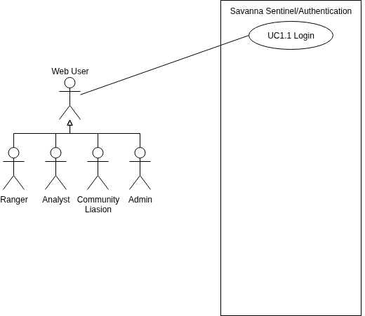

# SIGILL USE CASE DOCUMENT
---
## Use Case Diagrams

### Subsystem 1: Authentication
**NOTE:** This subsystem is included for completeness, even if they do not count towards the total use case count

#### Image

---
## Changelog
### V1 (From Demo 1)
- Refactored entire diagram to match feedback
- Introduced use case Scope
- Seperated use cases into more distinct subsystems
- Partioned actors into roles to make the diagram cleaner
- Minor improvements