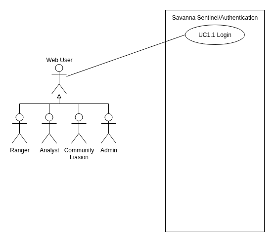

# SIGILL USE CASE DOCUMENT
---
## Acrnoyms Used
- TUCBW - This Use Case Begins With
- TUCEW - This Use Case Ends With
---
## Use Cases

### Subsystem 1: Authentication
**NOTE:** This subsystem is included for completeness, even if they do not count towards the total use case count

#### Image

#### Use Case Scope
| Use Case Number | Starts With/Ends With |
| --------------- | --------------------- |
| UC1. Login | TUCBW with the user being shown the login screen upon enterring the website.  TUCEW ends with the user being shown a confirmation message and being redirected to the dashboard. |
| 

---
## Changelog
### V1 (From Demo 1)
- Refactored entire diagram to match feedback
- Introduced use case Scope
- Seperated use cases into more distinct subsystems
- Partioned actors into roles to make the diagram cleaner
- Minor improvements